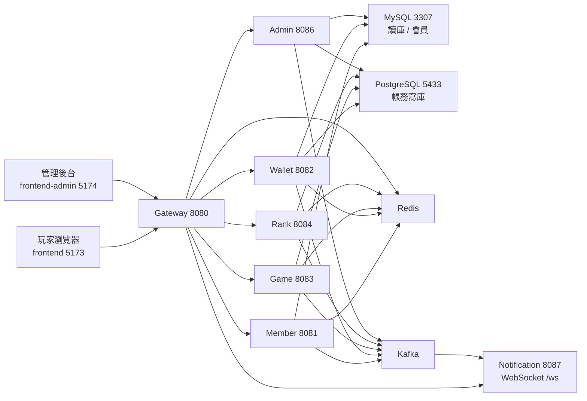

# Lucky Star Casino 專案功能總說明

> 最後校對：2026-07-13（依實際程式碼盤點重寫）
>
> ⚠️ 本檔在 2026-05 建立時寫的是「專案基底／骨架」，內容停留在「後端服務尚未實作、
> PostgreSQL 只有 `system_health_check` 一張表」。那些敘述**早已不成立**：七個後端服務、
> 三款遊戲、後台、推播、鑽石/商城/儲值皆已上線。本次依程式碼全面重寫。
>
> 想看更深的架構細節請讀 [`architecture.md`](architecture.md)；想看逐項任務進度請讀
> `AUDIT_REPORT.md` 附錄 A（自動產生）。

---

## 1. 這個專案是什麼

Lucky Star Casino（幸運星幣城）是一個**模擬幣**線上娛樂平台，**沒有真實金流**。
定位是社交娛樂 + 微服務架構練習：會員、錢包帳務、遊戲、排行榜、後台管理、即時推播。

技術骨幹：Java 21 / Spring Boot 3.3.5 微服務（Maven monorepo，套件根 `com.luckystar`）
+ Spring Cloud Gateway + React(Vite) 前端 ×2 + PostgreSQL/MySQL CQRS + Redis + Kafka。

---

## 2. 系統組成（皆已實作）



| 服務 | Port | 主要職責 |
|---|---|---|
| gateway-service | 8080 | 唯一對外入口：自適應併發卸載 → 限流 → JWT 驗證 → 路由 → 熔斷 |
| member-service | 8081 | 註冊/登入/JWT 輪替、個資、好友、每日簽到、月度累計獎勵 |
| wallet-service | 8082 | 星幣帳務（扣款/派彩/流水）、贈幣、破產補助、鑽石、禮品商城、自助加值 |
| game-service | 8083 | Provably Fair RNG、老虎機、百家樂、捕魚機、RTP 統計、風控、回饋 |
| rank-service | 8084 | 全服/好友/今日贏幣王排行榜、週榜重置、每日快照 |
| admin-service | 8086 | 後台認證、玩家管理、流通量報表、RTP 監控、異常偵測、GM 發幣、鑽石卡、商城目錄 |
| notification-service | 8087 | WebSocket(STOMP) 推播：遊戲結果、排行變動、系統通知 |

前端是**兩個獨立專案**：玩家端 `frontend/`（5173）、管理後台 `frontend-admin/`（5174）。
兩者的 JWT 是**兩套不同 secret**，不可混用。

---

## 3. 玩家能玩到什麼

| 功能 | 說明 |
|---|---|
| 老虎機 | 3×3 單中線兩階賠付（三連＋左二同），理論 RTP ≈ 93.8%、命中率 ≈ 30.7% |
| 百家樂 | 標準 Punto Banco 補牌表、莊贏扣 5% 傭金、和局押莊/閒退本金（見 [`baccarat-rules.md`](baccarat-rules.md)） |
| 捕魚機 | PixiJS canvas 引擎；**血量/傷害模型**（累積傷害 → 致命一擊才判定捕獲），buy-in 批次結算、殘血部分回收（ADR-003/004） |
| 排行榜 | 全服持幣榜、好友榜、今日贏幣王；週榜自動重置 |
| 社交 | 好友、贈幣、破產補助 |
| 簽到 | 每日簽到 + 月度累計里程碑獎勵 |
| 鑽石 | 點數卡兌換鑽石 → 鑽石換星幣 |
| 商城 | 星幣兌換禮品 + 背包 |
| 自助加值 | 模擬支付的儲值訂單（**無真實金流**） |
| 即時推播 | 遊戲結果、排行變動走 WebSocket |

> 前端預設走 **mock**（`VITE_USE_MOCK_API !== 'false'`）。要玩真後端請把它設成 `false`。
> mock 的玩法/賠付必須鏡像後端（單一真相＝後端 enum + `contracts/*.json`），詳見 AGENTS.md 雷區 14。

---

## 4. 資料存哪裡（CQRS，ADR-001）

- **PostgreSQL（帳務寫庫，強 ACID）**：`wallets`、`wallet_transactions`、`diamond_wallets`、
  `shop_redemptions`、`topup_orders`、`game_rounds`、`game_rtp_stats`、`cashback_records`、
  `pending_wallet_credits`、`rank_history`、`rank_daily_snapshots`、`admin_users`、
  `admin_alerts`、`admin_action_logs`、`dead_letter_messages`
- **MySQL（查詢讀庫）**：`members`、`friendships`、`daily_checkins`、`monthly_reward_claims`、
  `task_definitions`、`player_tasks`、`outbox_events`、`gift_logs`、`wallet_transactions`（讀視圖）、
  `diamond_cards`、`shop_items`
- **Redis**：refresh token、JWT 黑名單、停用旗標、遊戲/捕魚 session、風控計數、排行 ZSet、限流
- **Kafka**：8 個業務 topic + 5 個 DLT（清單見 `kafka/kafka-init.sh`）

**帳務兩大安全根基**：`wallet_transactions.idempotency_key` UNIQUE（防重複入帳）、
`wallets.version` 樂觀鎖（防超扣）。所有扣款/入帳都遵循這個模式。

---

## 5. 資料夾用途

| 路徑 | 用途 |
|---|---|
| `backend/*-service/` | 七個 Spring Boot 微服務 |
| `frontend/` | 玩家端 React + Vite + Redux Toolkit（含 PixiJS 捕魚引擎） |
| `frontend-admin/` | 管理後台 React |
| `contracts/*.json` | 玩法數值單一來源（mock 直接 import；後端由 `ContractParityTest` 守門） |
| `database/{mysql,postgres}/` | `init.sql` + `migration/` + 測試種子資料 |
| `kafka/kafka-init.sh` | Topic 自動建立腳本 |
| `tests/{infra,e2e,smoke,performance}/` | 基礎設施測試、E2E、冒煙、JMeter 壓測 |
| `tools/{audit,reconciliation,screenshot}/` | 進度快照產生器、帳務對帳、截圖 |
| `observability/` | Prometheus / Grafana 設定 |
| `docs/` | 本資料夾（見 [`README.md`](README.md) 索引） |

---

## 6. 怎麼跑起來

後端**已全部容器化**，一行起七服務 + 基礎設施：

```bash
cp .env.example .env      # 然後把所有 CHANGE_ME 換成自己生成的隨機值
docker compose up -d --build
```

⚠️ `.env` 的 `JWT_SECRET`／`INTERNAL_SECRET`／`CORS_ALLOWED_ORIGINS` **缺了就啟動失敗**（無預設值），
且密鑰不足 HS256 的 32 bytes 下限會 fail-fast——這是刻意設計。生成方式見
[`security/secret-rotation.md`](security/secret-rotation.md)。

詳細 SOP：根目錄 `DEPLOY.md`；新手逐步教學：[`ENV_SETUP_GUIDE.md`](ENV_SETUP_GUIDE.md)。

> Docker 的 `init.sql` **只在 volume 第一次建立時執行**。改了 schema 要重來：
> `docker compose down -v && docker compose up -d`（會清光本機 DB 資料）。

---

## 7. 現在還沒做的

- **捕魚 Redis session 原子化（Lua CAS）**：`plans/01` Phase 3，ADR-008 編號已保留，未動工。
- **T-090 效能調校 D1**：最終驗收拓樸（單機 vs 多機）與 gate 語意尚未拍板；
  1,000 併發下 429 佔比仍高（容量問題），見 `plans/02-T-090-效能調校藍圖.md`。
- **認證安全強化**：refresh token 仍存 localStorage、無絕對逾時、無改密碼端點，
  設計已寫成 [`specs/SPEC-001-auth-token-session-hardening.md`](specs/SPEC-001-auth-token-session-hardening.md)，待實作。
