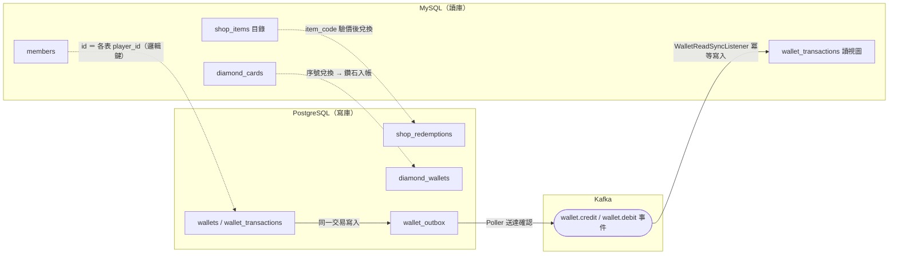

# 資料庫 ER 圖（PostgreSQL 寫庫 × MySQL 讀庫）

> 依 **ADR-001（CQRS 讀寫分離）**：PostgreSQL 為帳務寫入主庫（強 ACID），MySQL 為查詢讀庫（高頻查詢）。
> 微服務架構下**不設實體外鍵**（跨服務、跨資料庫），圖中所有關聯皆為「邏輯關聯」（以虛線表示），
> 一致性由冪等鍵 UNIQUE、樂觀鎖 `version` 與 Kafka 事件保證。
>
> 來源：`database/postgres/init.sql`、`database/mysql/init.sql`（2026-07-23 快照）。
> schema 有變動時請同步更新本檔。

---

## 1. PostgreSQL — 帳務寫入主庫（Port 5433）

帳務核心（wallet-service）、遊戲對局（game-service）、排行快照（rank-service）、後台（admin-service）。
`player_id` 一律邏輯對應 MySQL 的 `members.id`；`wallets` 以 `player_id` 為主鍵，是本庫的玩家錨點。

```mermaid
erDiagram
    wallets {
        BIGINT player_id PK "＝members.id（跨庫邏輯鍵）"
        BIGINT balance "可用餘額，>=0"
        BIGINT frozen_amount "凍結金額（保留）"
        BIGINT version "樂觀鎖"
        TIMESTAMP created_at
        TIMESTAMP updated_at
    }
    wallet_transactions {
        BIGSERIAL id PK
        BIGINT player_id
        VARCHAR type "DEBIT/CREDIT/BONUS"
        VARCHAR sub_type "BET/WIN/CHECKIN/GIFT/..."
        BIGINT amount ">0"
        BIGINT balance_before
        BIGINT balance_after
        VARCHAR idempotency_key UK "冪等鍵"
        VARCHAR reference_id "round_id/event_id"
        TIMESTAMP created_at
    }
    shop_redemptions {
        BIGSERIAL id PK
        BIGINT player_id
        VARCHAR item_code "對應 MySQL shop_items"
        VARCHAR item_name
        BIGINT star_spent ">0"
        BIGINT balance_before
        BIGINT balance_after
        VARCHAR idempotency_key UK
        VARCHAR status "COMPLETED/PENDING/FAILED"
        TIMESTAMP created_at
    }
    topup_orders {
        BIGSERIAL id PK
        VARCHAR order_no UK "冪等鍵來源"
        BIGINT player_id
        VARCHAR package_id "P100/P500/P1000"
        BIGINT amount ">0"
        VARCHAR price_label
        VARCHAR status "CREATED/PAID/CREDITED/FAILED"
        BIGINT credit_tx_id FK "→wallet_transactions.id"
        TIMESTAMP created_at
        TIMESTAMP paid_at
    }
    cashback_records {
        BIGSERIAL id PK
        BIGINT player_id
        VARCHAR period_type "DAILY/WEEKLY"
        DATE period_start
        BIGINT loss_amount ">0"
        NUMERIC cashback_rate
        BIGINT cashback_amount ">0"
        VARCHAR idempotency_key UK
        VARCHAR status "PENDING/CREDITED/FAILED"
        TIMESTAMP created_at
        TIMESTAMP credited_at
    }
    diamond_wallets {
        BIGINT player_id PK "與 wallets 平行"
        BIGINT balance "鑽石餘額，>=0"
        BIGINT version "樂觀鎖"
        TIMESTAMP created_at
        TIMESTAMP updated_at
    }
    game_rounds {
        BIGSERIAL id PK
        VARCHAR round_id UK "UUID"
        BIGINT player_id
        VARCHAR game_type "SLOT/BACCARAT/FISHING"
        BIGINT bet_amount
        BIGINT win_amount "含本金派彩"
        BIGINT balance_before
        BIGINT balance_after
        TIMESTAMP bet_at
        VARCHAR server_seed "開獎後揭露"
        VARCHAR server_seed_hash "下注前公開"
        VARCHAR client_seed
        BIGINT nonce
        TEXT result_data "JSON"
        VARCHAR status "STARTED/SETTLED"
        TIMESTAMP created_at
        TIMESTAMP settled_at
    }
    pending_wallet_credits {
        BIGSERIAL id PK
        VARCHAR game_type
        VARCHAR round_id "roundId 或捕魚 sessionId"
        BIGINT player_id
        BIGINT amount ">0"
        VARCHAR sub_type "WIN/REFUND"
        VARCHAR idempotency_key UK "與原始 credit 相同"
        VARCHAR status "PENDING/DONE/FAILED"
        INT retry_count
        VARCHAR last_error
        TIMESTAMP next_retry_at "指數退避"
        TIMESTAMP created_at
        TIMESTAMP done_at
    }
    wallet_outbox {
        BIGSERIAL id PK
        VARCHAR topic "wallet.credit / wallet.debit"
        VARCHAR kafka_key "playerId"
        TEXT payload "JSON"
        VARCHAR status "PENDING/SENT"
        INT retry_count
        TIMESTAMP created_at
        TIMESTAMP sent_at
    }
    rank_history {
        BIGSERIAL id PK
        BIGINT player_id
        VARCHAR nickname
        BIGINT balance
        INT rank
        DATE week_start "該週週一"
        TIMESTAMP created_at
    }
    rank_daily_snapshots {
        BIGSERIAL id PK
        BIGINT player_id UK "UK(player,date)"
        BIGINT balance
        DATE snapshot_date UK
        TIMESTAMP created_at
    }
    game_rtp_stats {
        BIGSERIAL id PK
        VARCHAR game_type "SLOT/BACCARAT/FISHING"
        BIGINT total_bet
        BIGINT total_win
        INT round_count
        TIMESTAMP calculated_at "每小時排程"
    }
    admin_users {
        BIGSERIAL id PK
        VARCHAR username UK
        VARCHAR password_hash "BCrypt"
        VARCHAR role "SUPER_ADMIN/OPERATOR"
        BOOLEAN enabled
        TIMESTAMP created_at
        TIMESTAMP updated_at
    }
    admin_action_logs {
        BIGSERIAL id PK
        VARCHAR operator "＝admin_users.username"
        VARCHAR action_type "GM_GRANT 等"
        BIGINT target_player_id
        BIGINT amount
        VARCHAR reason
        VARCHAR idempotency_key UK
        TIMESTAMP created_at
    }
    admin_alerts {
        BIGSERIAL id PK
        BIGINT player_id
        VARCHAR alert_type "BIG_WIN/HIGH_FREQUENCY/ABNORMAL_TRANSFER"
        TEXT detail
        BOOLEAN is_resolved
        VARCHAR resolved_by "後台操作者"
        TIMESTAMP resolved_at
        TIMESTAMP created_at
    }
    dead_letter_messages {
        BIGSERIAL id PK
        VARCHAR dlt_topic
        VARCHAR original_topic
        VARCHAR message_key
        TEXT payload
        VARCHAR exception_class
        TEXT failure_reason
        TEXT stack_trace
        VARCHAR status "FAILED/RETRIED/RESOLVED"
        INT retry_count
        TIMESTAMP created_at
        TIMESTAMP last_retried_at
    }

    wallets ||..o{ wallet_transactions : "player_id"
    wallets ||..o{ shop_redemptions : "player_id"
    wallets ||..o{ topup_orders : "player_id"
    wallets ||..o{ cashback_records : "player_id"
    wallets ||..o| diamond_wallets : "player_id（開戶後才有）"
    wallets ||..o{ game_rounds : "player_id"
    topup_orders |o..o| wallet_transactions : "credit_tx_id（入帳後回填）"
    game_rounds |o..o{ pending_wallet_credits : "round_id（捕魚為 sessionId）"
    wallets ||..o{ rank_history : "player_id"
    wallets ||..o{ rank_daily_snapshots : "player_id"
    wallets ||..o{ admin_alerts : "player_id"
    admin_users ||..o{ admin_action_logs : "operator＝username"
    admin_users |o..o{ admin_alerts : "resolved_by"
```



<details>
<summary>Mermaid 原始碼（schema 變動時改這裡並重新產圖，見文末說明）</summary>



</details>

### 表格清單（16 張）

| 資料表 | 所屬服務 | 用途 |
|---|---|---|
| `wallets` | wallet | 玩家星幣錢包主表；`version` 樂觀鎖防超扣（T-022） |
| `wallet_transactions` | wallet | 帳務流水（不可變）；`idempotency_key` UNIQUE 防重複入帳 |
| `shop_redemptions` | wallet | 禮品商城兌換紀錄，與扣款同交易原子寫入（ADR-006） |
| `topup_orders` | wallet | 模擬加值訂單：CREATED → PAID → CREDITED |
| `cashback_records` | wallet | 每日/每週虧損返利，防排程重複發放 |
| `diamond_wallets` | wallet | 鑽石錢包（T-100），與星幣錢包平行 |
| `wallet_outbox` | wallet | Transactional Outbox：事件與帳務同交易落地（藍圖 04 P2） |
| `game_rounds` | game | 對局紀錄 + Provably Fair 種子（seed/hash/nonce） |
| `pending_wallet_credits` | game | credit 失敗補償單（ADR-009 Saga），同冪等鍵重試 |
| `rank_history` | rank | 週排行榜 TOP N 歷史快照 |
| `rank_daily_snapshots` | rank | 每日持幣量快照（每人每日一筆） |
| `game_rtp_stats` | game/admin | RTP 統計彙總，每小時排程寫入 |
| `admin_users` | admin | 後台管理員帳號（獨立 ADMIN_JWT_SECRET） |
| `admin_action_logs` | admin | 敏感操作稽核（GM 發幣等，T-055） |
| `admin_alerts` | admin | 異常告警（大額贏幣/高頻下注/異常轉帳） |
| `dead_letter_messages` | wallet | Kafka DLT 失敗訊息落庫（T-028） |

---

## 2. MySQL — 查詢讀庫（Port 3307）

會員/社交/任務（member-service）、商城目錄與點數卡（admin 管理）、帳務流水讀視圖（CQRS 讀端）。
`members` 是全系統玩家主檔，其 `id` 即各處的 `player_id`。

> 圖中 `wallet_transactions_view` 實際表名為 `wallet_transactions`（與 PG 寫庫同名）；
> 為避免混淆，圖上加 `_view` 後綴標示。

```mermaid
erDiagram
    members {
        BIGINT id PK "＝全系統 player_id"
        VARCHAR username UK
        VARCHAR email UK
        VARCHAR password_hash "BCrypt"
        VARCHAR nickname
        TEXT avatar "URL 或 Base64"
        VARCHAR role "PLAYER/ADMIN"
        VARCHAR status "ACTIVE/DISABLED"
        TINYINT is_new_gift_claimed
        DATETIME created_at
        DATETIME updated_at
    }
    friendships {
        BIGINT id PK
        BIGINT requester_id UK "UK(requester,receiver)"
        BIGINT receiver_id UK
        VARCHAR status "PENDING/ACCEPTED/REJECTED"
        BIGINT version "樂觀鎖：防併發接受/拒絕"
        TIMESTAMP created_at
        TIMESTAMP updated_at
    }
    daily_checkins {
        BIGINT id PK
        BIGINT player_id UK "UK(player,date) 防同日重複"
        DATE checkin_date UK
        INT consecutive_days
        TIMESTAMP created_at
    }
    monthly_reward_claims {
        BIGINT id PK
        BIGINT player_id UK "UK(player,month,milestone)"
        VARCHAR reward_month UK "yyyy-MM 台北時區"
        INT milestone_days UK "10/20/28"
        BIGINT reward_amount ">0"
        DATETIME claimed_at
    }
    task_definitions {
        BIGINT id PK
        VARCHAR task_code UK
        VARCHAR task_name
        VARCHAR task_type "FIRST_LOGIN/DAILY_CHECKIN/..."
        BIGINT reward_amount ">0"
        INT target_count
        BOOLEAN is_active
    }
    player_tasks {
        BIGINT id PK
        BIGINT player_id UK "UK(player,task)"
        BIGINT task_id UK
        INT progress
        BOOLEAN is_completed
        TIMESTAMP completed_at
    }
    gift_logs {
        BIGINT id PK
        BIGINT sender_id
        BIGINT receiver_id
        BIGINT amount ">0（Redis 管每日限額）"
        TIMESTAMP created_at
    }
    outbox_events {
        BIGINT id PK
        VARCHAR topic
        VARCHAR kafka_key
        TEXT payload "JSON"
        VARCHAR status "PENDING/..."
        INT retry_count
        DATETIME created_at
        DATETIME sent_at
    }
    wallet_transactions_view {
        BIGINT id PK "與 PG 主庫 id 一致"
        BIGINT player_id
        VARCHAR type "DEBIT/CREDIT/BONUS"
        VARCHAR sub_type
        BIGINT amount
        BIGINT balance_before
        BIGINT balance_after
        VARCHAR idempotency_key "唯讀複本，無 UNIQUE"
        VARCHAR reference_id
        TIMESTAMP created_at
    }
    diamond_cards {
        BIGINT id PK
        VARCHAR card_code UK "XXXX-XXXX-XXXX-XXXX"
        BIGINT face_value ">0 鑽石數"
        TINYINT is_redeemed "DB 層防重複兌換"
        BIGINT redeemed_by "兌換玩家"
        DATETIME redeemed_at
        DATETIME created_at
    }
    shop_items {
        BIGINT id PK
        VARCHAR item_code UK
        VARCHAR name
        VARCHAR caption
        BIGINT cost_star ">0"
        VARCHAR asset_key "前端圖片鍵"
        INT sort_order
        TINYINT active "上下架"
        DATETIME created_at
        DATETIME updated_at
    }
    system_health_check {
        BIGINT id PK
        VARCHAR service_name
        VARCHAR status
        TIMESTAMP checked_at
    }

    members ||..o{ friendships : "requester_id"
    members ||..o{ friendships : "receiver_id"
    members ||..o{ daily_checkins : "player_id"
    members ||..o{ monthly_reward_claims : "player_id"
    members ||..o{ player_tasks : "player_id"
    task_definitions ||..o{ player_tasks : "task_id"
    members ||..o{ gift_logs : "sender_id"
    members ||..o{ gift_logs : "receiver_id"
    members ||..o{ wallet_transactions_view : "player_id"
    members |o..o{ diamond_cards : "redeemed_by（未兌換為 NULL）"
```



<details>
<summary>Mermaid 原始碼（schema 變動時改這裡並重新產圖，見文末說明）</summary>



</details>

### 表格清單（12 張）

| 資料表 | 所屬服務 | 用途 |
|---|---|---|
| `members` | member | 玩家主檔；`id` 即全系統 `player_id` |
| `friendships` | member | 好友申請/接受；UNIQUE(requester, receiver) 防重複 |
| `daily_checkins` | member | 每日簽到；UNIQUE(player, date) 防同日重複 |
| `monthly_reward_claims` | member | 月度累計簽到里程碑獎勵（10/20/28 天，ADR-005） |
| `task_definitions` | member | GM 預設任務模板 |
| `player_tasks` | member | 玩家任務進度；UNIQUE(player, task) |
| `gift_logs` | member | 好友贈幣歷史；每日限額由 Redis 即時控管 |
| `outbox_events` | member | member 端 Transactional Outbox（OutboxPoller 推 Kafka） |
| `wallet_transactions` | wallet（讀） | 帳務流水讀視圖，由 Kafka 事件同步自 PG（最終一致） |
| `diamond_cards` | admin/wallet | 鑽石點數卡序號；`card_code` UNIQUE 防重複兌換 |
| `shop_items` | admin/wallet | 商城目錄（admin CRUD、wallet 讀取驗價，ADR-006） |
| `system_health_check` | 共用 | 基礎建設健康檢查 |

---

## 3. 跨庫邏輯關係（CQRS 資料流）

兩庫之間沒有任何實體外鍵，靠三種機制黏合：共用邏輯鍵 `player_id`、Kafka 事件同步、以及「目錄在讀庫、帳務在寫庫」的分工。



<details>
<summary>Mermaid 原始碼（schema 變動時改這裡並重新產圖，見文末說明）</summary>



</details>

- **玩家身分**：`members.id`（MySQL）＝ 所有表的 `player_id`，是唯一的跨庫共用鍵。
- **帳務流水同步**：PG 寫入 → 同交易落 `wallet_outbox` → Poller 送 Kafka → 讀庫視圖冪等更新（at-least-once，最終一致）。餘額查詢一律查 PG。
- **商城**（ADR-006）：目錄 `shop_items` 在 MySQL（admin 管理），兌換帳務 `shop_redemptions` 在 PG（與扣款同交易）。
- **鑽石**：卡序號 `diamond_cards` 在 MySQL，兌換後入帳 `diamond_wallets` 在 PG。

---

## 附：如何重新產圖

圖片由各節摺疊區塊內的 Mermaid 原始碼渲染而成。schema 變動時：
① 改對應摺疊區塊的 Mermaid 原始碼 → ② 把該區塊內容存成 `.mmd` 檔 → ③ 用 mermaid-cli 重新輸出 PNG：

```bash
npx -y @mermaid-js/mermaid-cli -i er-postgres.mmd -o docs/assets/er/er-postgres.svg -b white
```

（`-b white` 白底；輸出 SVG 向量圖，放大不失真。三張圖檔名：`er-postgres.svg` / `er-mysql.svg` / `er-cross-db-cqrs.svg`）
