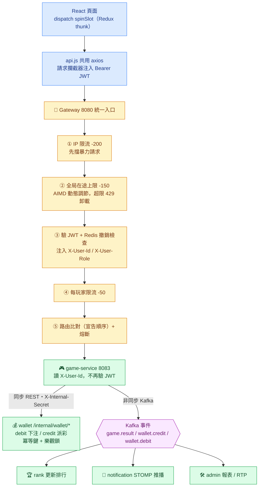
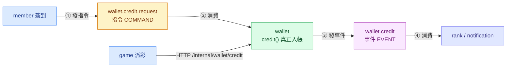
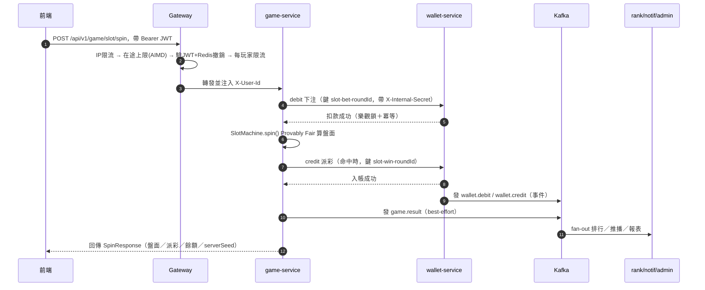

# 10 — API 串接與架構

> 這份專講「一個請求怎麼從前端一路串到底層」：前端 axios → Gateway 路由與 JWT → 服務間同步 REST → Kafka 非同步事件。
> 前半（§1–§4）是技術參考（結構表 / 路由表 / 片段），後半（§5–§7）是面試「為什麼這樣串」與被追問怎麼答。
> 想看「怎麼在本機把它跑起來」翻 `../LOCAL_API_INTEGRATION_GUIDE.md`；想看規格與服務邊界翻 `../architecture.md`；決策原文在 `../adr/ADR-001.md`（CQRS）、`../adr/ADR-002.md`（指令/事件分離）。本檔不重複那些，只用面試口吻把它們串成一條線。

> 📖 **圖怎麼看**：本檔的流程圖是 **mermaid 彩色圖**——藍＝前端、黃＝Gateway、綠＝後端服務、紫＝Kafka 事件。另有一份離線匯出 HTML（`../_雜物/08-面試準備-API串接與架構-匯出.html`，打開即有彩圖、不需連網，但內容為舊版快照、以本檔為準），用瀏覽器 `Ctrl+P` 可直接轉 PDF。

---

## 1. 一張圖看懂全鏈路

> 🎯 **一句話重點**：API 串接分三種介面——**前端↔後端**（經 Gateway + JWT）、**服務↔服務同步**（RestClient + internal secret）、**服務↔服務非同步**（Kafka 指令/事件）。全檔都是在展開這三條。

整個系統的 API 串接分成**三種「介面」**，各有各的鑑權方式與同步/非同步語意。先記住這張總表，其餘章節都是在展開它：

| 串接介面 | 用在哪 | 協定 | 鑑權方式 | 同步/非同步 |
|---|---|---|---|---|
| **前端 ↔ 後端** | React 頁面呼叫任何 API | REST / HTTP，一律經 Gateway | `Authorization: Bearer <JWT>` | 同步 |
| **服務 ↔ 服務（同步）** | game 下注要即時扣款/派彩 | REST 打 `/internal/**` | `X-Internal-Secret` header | 同步 |
| **服務 ↔ 服務（非同步）** | 帳務變動要通知排行/推播 | Kafka topic | 網路邊界內信任 | 非同步（事件驅動） |

一條完整請求（以玩老虎機一局為例）的鏈路：



> **面試怎麼講（一句話版）**：「我們的 API 串接分三層——對外只開 Gateway 一個入口、用 JWT；服務間要即時結果就走帶 internal secret 的 REST；不需要即時、只是要通知別人的，就走 Kafka 事件。」

---

## 2. 前端如何串接後端

> 🎯 **一句話重點**：前端只認識一個位址（Gateway），token 靠攔截器自動掛、401 靠 single-flight 靜默續期，資料源預設鏡像後端（mock），對外行為與真後端一致。

### 2.1 service 層結構

前端把「呼叫後端」集中在 `frontend/src/services/`，一個檔對應一個後端服務（都經 Gateway），並統一提供「mock 分支 + 真實分支」兩條路：

| 檔案 | 對應後端 | 職責 |
|---|---|---|
| `services/api.js` | —（基礎建設） | 共用 axios instance、JWT 注入、401 續期攔截器 |
| `services/memberApi.js` | member / auth | 登入、註冊、profile、好友；含重試與友善錯誤轉換 |
| `services/gameApi.js` | game | 老虎機 spin、百家樂、捕魚機 session/射擊/結算 |
| `services/walletApi.js` | wallet / member | 餘額、簽到、加值、交易流水、贈幣 |
| `services/diamondApi.js` | wallet（diamond） | 鑽石餘額、兌換卡、鑽石換星幣 |
| `services/rankApi.js` | rank | 全球榜/好友榜/我的名次 |
| `services/shopApi.js` | wallet（shop） | 商城目錄、兌換、背包 |
| `services/mockApi.js` | —（假後端） | localStorage 假 DB，鏡像後端引擎 |

每個 api 檔的呼叫慣例一致：先判斷要不要走 mock，真實分支取 `res.data.data`（後端統一用 `ApiResponse{ data }` 信封包裝；唯一例外是 `rankApi`，因 `RankController` 直接回 `List`，故取 `res.data`）。多數方法還帶一個「欄位映射函式」把後端命名轉成前端形狀。

### 2.2 共用 axios：baseURL 指向 Gateway

```js
// frontend/src/services/api.js
const api = axios.create({
  baseURL: import.meta.env.VITE_API_BASE_URL || '',   // = http://localhost:8080（Gateway）
  timeout: 10000,
  headers: { 'Content-Type': 'application/json' },
})
```

`VITE_API_BASE_URL` 指到 **Gateway(8080)**，不是各個服務的 port。前端只認識一個位址——這就是「Gateway 統一入口」在前端的體現：服務換 port、拆分、搬機器，前端完全不用改。

### 2.3 請求攔截器：每個請求自動帶 JWT

```js
// frontend/src/services/api.js — 從 Redux store 取 token 掛上去
api.interceptors.request.use((config) => {
  const token = store.getState().auth.accessToken
  if (token) config.headers.Authorization = `Bearer ${token}`
  return config
})
```

> **為什麼從 store 拿而不是每個呼叫傳進來**：token 是全域狀態，集中在攔截器注入，業務程式碼就不用每次手動帶 header，也不會漏帶。

### 2.4 回應攔截器：401 靜默續期（single-flight）

這是前端串接裡最值得講的一段。access token 過期會拿到 401，攔截器會**自動用 refresh token 換新的、再重送原請求**，使用者無感；換不到才登出：

```js
// frontend/src/services/api.js（節錄）
let refreshPromise = null   // single-flight：多請求同時 401 共用同一次續期

api.interceptors.response.use(
  (response) => response,
  async (error) => {
    const config = error.config || {}
    const isAuthEndpoint = (config.url || '').includes('/api/v1/auth/')
    // 非 401、或 auth 端點、或已重試過、或明示 skipAuthRedirect → 交回呼叫端
    if (error.response?.status !== 401 || config.skipAuthRedirect
        || isAuthEndpoint || config._retry) {
      return Promise.reject(error)
    }
    if (useMockApi || !store.getState().auth.refreshToken) {
      forceLogout(); return Promise.reject(error)
    }
    config._retry = true
    try {
      refreshPromise = refreshPromise
        || refreshAccessToken().finally(() => { refreshPromise = null })
      const newToken = await refreshPromise
      config.headers.Authorization = `Bearer ${newToken}`
      return api(config)          // 重送原請求
    } catch (e) {
      forceLogout(); return Promise.reject(e)
    }
  }
)
```

三個設計重點（面試可逐點展開）：

1. **single-flight（`refreshPromise`）**：後端 refresh 會**輪替 refresh token**（換一次舊的就作廢）。若 10 個請求同時 401、各自去 refresh，只有第一個成功、其餘拿作廢 token 續期會失敗。用一個共享的 `refreshPromise` 序列化，10 個請求共用同一次續期結果。
2. **用「乾淨」的 axios 呼叫 refresh**：`refreshAccessToken()` 用原生 `axios.post` 而非 `api` 實例，避免被自己的攔截器遞迴攔截，也避免請求攔截器又掛上那顆已過期的 access token。
3. **白名單不重導**：`/api/v1/auth/*`（帳密錯誤本來就會 401）與帶 `skipAuthRedirect` 的請求（登入流程剛簽出 token 就抓 profile）不觸發整頁登出重導，交呼叫端處理，否則會把表單/錯誤訊息洗掉。

> 💬 **面試現場**
> 🙋 **面試官**：「Access token 過期，使用者會不會突然被登出？」
> 🧑‍💻 **你**：「不會。我在 axios 回應攔截器攔 401，用 refresh token 靜默換一顆新的再把原請求重送，使用者無感。重點是我用 single-flight——同時 401 的多個請求只觸發一次續期，避免 refresh token 輪替造成互相把對方的 token 洗掉。真的換不到才登出。」

### 2.5 mock 機制與「單一真相＝後端」

所有 service 檔用同一個開關：

```js
const useMockApi = import.meta.env.VITE_USE_MOCK_API !== 'false'
```

注意這行的語意：**除非環境變數明確等於字串 `'false'`，否則一律走 mock**——也就是**程式碼層級的 fallback 預設是 mock**。但版控裡的 `.env.development` 與 `.env.local` 都寫死 `VITE_USE_MOCK_API=false`，所以 `npm run dev` 實際是串真後端；只有 `vite --mode mock`（`.env.mock`，給 e2e 用）才走假資料。

> ★ 面試若被追問「你們前端預設走 mock 還是真後端？」要講清楚這個區別：**程式碼 fallback 是 mock（漏設變數也能跑 UI），但版控環境檔覆寫成串真後端**，兩者不衝突。

`mockApi.js` 用 localStorage 當假 DB，並**逐條複製後端演算法**（老虎機賠付表、百家樂補牌規則、捕魚血量/傷害模型…），註解標明對齊哪個後端類別。鐵則：**改後端遊戲規則時必須同步改 mock**，否則玩家在 mock 模式體驗到的世界會跟真後端分歧（見 `AGENTS.md` 雷區 14）。

### 2.6 Redux 串接模式：thunk + 三態

需要打 API 的動作都用 `createAsyncThunk` 包 service 方法，用 `extraReducers` 的 pending/fulfilled/rejected 三態管理 `loading` 與 `error`：

```js
// frontend/src/store/slices/gameSlice.js（節錄）
export const spinSlot = createAsyncThunk('game/spinSlot', async (payload, { rejectWithValue }) => {
  try { return await gameApi.spinSlot(payload) }
  catch (error) { return rejectWithValue(extractError(error)) }
})
// extraReducers：
.addCase(spinSlot.pending,   (s)   => { s.loading = true;  s.status = 'spinning'; s.error = null })
.addCase(spinSlot.fulfilled, (s,a) => { s.loading = false; s.status = 'result'; s.roundId = a.payload.roundId })
.addCase(spinSlot.rejected,  (s,a) => { s.loading = false; s.status = 'idle'; s.error = a.payload || '老虎機下注失敗' })
```

這與 `api.js` 攔截器形成閉環：攔截器讀 `store.getState().auth.accessToken`、續期後 dispatch `tokenRefreshed`、失敗 dispatch `logout`。

---

## 3. Gateway：統一入口與路由

> 🎯 **一句話重點**：Gateway 把鑑權、CORS、限流、熔斷、路由這些「橫切關注點」集中在單一入口；路由**按 yml 宣告順序**比對，具體路徑一定要排在 catch-all 之前。

### 3.1 為什麼要 Gateway，而不是前端直連各服務

| 面向 | ❌ 前端直連各服務 | ✅ 有了 Gateway 後 |
|---|---|---|
| 位址 / CORS | 前端要記 7 組位址、CORS 要在每個服務各設一次 | 前端只認一個位址、CORS 在 Gateway 設一次 |
| JWT 驗證 | 驗證邏輯要複製到每個服務 | JWT 只在 Gateway 驗一次，下游信任注入的 header |
| 限流 / 熔斷 | 散落各處、難統一 | 集中在邊界，統一治理 |

一句話：**Gateway 把「橫切關注點」（鑑權、CORS、限流、熔斷、路由）從各業務服務抽出來，集中在單一入口**。

### 3.2 路由順序表 ★（宣告順序就是比對順序）

`gateway-service/src/main/resources/application.yml` 的 `routes` 由上而下比對，**具體路徑必須排在 catch-all 之前**：

| # | route id | Path | 轉發到 | 備註 |
|---|---|---|---|---|
| 1 | `openapi-*` | `/v3/api-docs/{service}` | 各服務 | Swagger 文件代理 |
| 2 | `member-auth` | `/api/v1/auth/**` | member 8081 | 白名單免 JWT + 限流 |
| 3 | `member-player` | `/api/v1/player/**` | member 8081 | |
| 4 | `member-friends` | `/api/v1/friends/**` | member 8081 | |
| 5 | **`member-checkin`** | `/api/v1/wallet/daily-checkin,/api/v1/wallet/checkin/**` | **member 8081** | ★見下方陷阱 |
| 6 | `wallet` | `/api/v1/wallet/**` | wallet 8082 | catch-all |
| 7 | `game` | `/api/v1/game/**` | game 8083 | |
| 8 | `rank` | `/api/v1/rank/**` | rank 8084 | |
| 9 | `admin` | `/admin/**` | admin 8086 | 需 ADMIN role |

★ **路由順序陷阱**（`AGENTS.md` 雷區 19）：每日簽到端點實作在 **member-service**，但路徑落在 `/api/v1/wallet/` 底下。若第 5 條 `member-checkin` 沒排在第 6 條 `wallet` catch-all **之前**，簽到請求會被 catch-all 吃掉、轉去 wallet-service（那裡沒這些端點）→ 404。yml 註解也直接寫明這點。

> 對照：禮品商城 `/api/v1/wallet/shop/**`（雷區 20）因為端點**就在 wallet-service 內**，反而是被第 6 條 catch-all 正確吃下，**免加路由**。「要不要新增路由」的判準是「這條路徑的實作在不在該 catch-all 對應的服務裡」。

> 💬 **面試現場**
> 🙋 **面試官**：「Spring Cloud Gateway 的路由是怎麼比對的？你有沒有踩過相關的雷？」
> 🧑‍💻 **你**：「它按 yml 宣告順序由上往下比對，命中第一條就轉發。我踩過的雷是——每日簽到端點路徑是 `/api/v1/wallet/daily-checkin`，但實作在 member-service。一開始它排在 `/api/v1/wallet/**` 這條 catch-all 後面，結果簽到請求被 catch-all 先吃掉、轉去 wallet-service，回 404。把它移到 catch-all 前面就好了。所以我學到具體路徑一定要排在萬用路徑之前。」

### 3.3 Gateway filter 執行順序

全域 filter 的 order（數字越小越早）定義在 `filter/FilterOrder.java`：

```
RATE_LIMIT (-200)  →  CONCURRENCY_LIMIT (-150)  →  JWT_AUTHENTICATION (-100)  →  PLAYER_RATE_LIMIT (-50)  →  路由轉發 (≥0)
```

順序是刻意的：

1. **先做 IP 層限流**——暴力請求在最外層就擋掉，不浪費後面驗證的資源。
2. **再做 per-route 全局在途上限**（T-090 C1/C3）——game/wallet 路徑各自維護「同時在途請求數」上限，超限直接 429 快速卸載；刻意排在 JWT **之前**，被拒請求連 Redis 撤銷查詢都不消耗。上限不是固定值，由 `AdaptiveInFlightLimiter` 用 **AIMD**（延遲達標加法增、超標乘法減）動態調節（初始 200、floor 50、ceiling 400、延遲目標 2s）。
3. **再驗 JWT**——驗過才拿得到 `X-User-Id`。
4. **最後做每玩家限流**——這一步依賴上一步注入的 `X-User-Id` 當計數金鑰，所以必須排在 JWT 之後。

### 3.4 韌性設定（一句話帶過即可）

- **HttpClient 連線池**：`max-idle-time: 10s` 刻意設得比下游 Tomcat 的 `keepAliveTimeout`（預設 20s）短，並開背景驅逐。否則 Gateway 會重用「下游已關閉的 keep-alive 連線」→ 偶發 503。
- **全域 Retry**：只對 **GET（冪等）** 自動重試；POST（註冊/登入/下注）不重試，避免重複副作用。
- **Resilience4j CircuitBreaker**：每個下游服務一個 instance，失敗率 >50% 或慢呼叫（>3s）率 >80% 觸發熔斷，走 `fallbackUri`。
- **TimeLimiter 顯式拉高到 6s**（T-090 壓測教訓）：未顯式設定時 Spring Cloud CircuitBreaker 預設逾時只有 **1 秒**，比 slow-call 門檻（3s）短得多——高併發排隊下呼叫在被判定為「慢」之前就被 TimeLimiter 腰斬判 failed，觸發熔斷反覆開闔、half-open 放行又引發 thundering herd。拉高到略大於 slow-call 門檻，讓慢呼叫真正完成、交由 slow-call 統計判定（修正後 150 併發 5xx 78%→0）。
- **JWT filter 的 Redis 撤銷查詢加瞬時錯誤短重試**（T-090 C2）：`retryWhen` backoff 重試 1 次/50ms，吸收壓力下的瞬時抖動；fail-closed 語意不變，重試耗盡仍拒絕。

---

## 4. JWT 簽發與驗證 + 服務間信任邊界

> 🎯 **一句話重點**：JWT 由 member 簽、Gateway 驗（並在 Redis 補撤銷檢查）；玩家端用 JWT、服務間內部端改用 internal secret——兩種身分、兩種邊界。

### 4.1 簽發（member-service）

登入成功後由 member-service 用 JJWT 簽 access + refresh 兩顆 token：

```java
// member-service .../security/JwtTokenProvider.java（節錄）
Jwts.builder()
    .id(UUID.randomUUID().toString())      // jti — 供黑名單即時撤銷
    .subject(String.valueOf(memberId))     // sub = playerId
    .claim("role", role)
    .claim("type", type)                   // access / refresh
    .issuedAt(now)
    .expiration(new Date(now.getTime() + expiryMs))
    .signWith(secretKey)                   // HMAC-SHA
    .compact();
```

refresh token 存進 Redis（TTL = 剩餘壽命）；換發時輪替（呼應 §2.4 前端的 single-flight）。

### 4.2 驗證（gateway 的 `JwtAuthenticationGlobalFilter`）

流程：

1. 白名單路徑（`/api/v1/auth/`、`/actuator/health`、`/swagger-ui`…）直通，並**先剝除用戶端偽造的 `X-User-Id`/`X-User-Role`**。
2. 抽 `Authorization: Bearer`，缺則 401。
3. `Jwts.parser().verifyWith(signingKey)...parseSignedClaims()` 驗簽 + 檢查過期。
4. **Redis 三道撤銷檢查**：黑名單 `jwt:blacklist:{jti}`、使用者停用 `disabled:player:{sub}`、簽發下限 `token:min-iat:{sub}`（iat 早於門檻即視為撤銷）。
5. **Redis 故障 → fail-closed**：查不到就拒絕（而非放行），避免撤銷機制失效。
6. `/admin/**` 需 `role == ADMIN`，否則 403（default-deny）。
7. 通過後**先 remove 再 set** `X-User-Id`/`X-User-Role` 才轉發下游，防止用戶端偽造殘留。

> 💬 **面試現場**
> 🙋 **面試官**：「JWT 是無狀態的，那你怎麼做登出／即時撤銷？」
> 🧑‍💻 **你**：「純 JWT 驗簽確實無法主動失效，所以我在 Gateway 補一層 Redis 撤銷檢查——每顆 token 有 jti，登出就把 jti 丟黑名單；封號就設一個 min-iat 門檻，比它早簽發的一律作廢。等於『無狀態驗簽 + 有狀態撤銷』並用。代價是每次請求多一次 Redis 查詢，但換到可即時登出，而且 Redis 掛掉時我選擇 fail-closed，寧可拒絕也不放行。」

**關鍵前提**：Gateway 與 member-service 的 `jwt.secret` 必須完全一致（yml 用 `${JWT_SECRET:?...}` 強制環境變數，缺就啟動失敗）。下游服務（如 `SlotController`）**不再自己驗 JWT，只讀 Gateway 注入的 `X-User-Id`**。

### 4.3 服務間信任邊界：玩家端 vs 內部端

| 面向 | 🌐 玩家端 `/api/v1/**` | 🔒 內部端 `/internal/**` |
|---|---|---|
| 誰打 | 前端（玩家） | 其他微服務 |
| 鑑權 | Gateway 驗 JWT → 注入 `X-User-Id` | `X-Internal-Secret` header |
| 經過 Gateway？ | ✅ 是 | ❌ 否（服務直連，少一跳） |
| 代表的身分 | 「某個玩家」 | 「可信的內部服務」 |

game→wallet 是唯一一條同步服務呼叫，用 Spring 6 內建的 `RestClient`（不是 Feign/WebClient）：

```java
// game-service .../config/WalletClientConfig.java
@Bean
public RestClient walletRestClient(
        @Value("${internal.wallet-service.base-url}") String baseUrl,
        @Value("${internal.wallet-service.secret}") String internalSecret) {
    return RestClient.builder()
            .baseUrl(baseUrl)
            .defaultHeader("X-Internal-Secret", internalSecret)   // 每次呼叫自動帶
            .defaultHeader(HttpHeaders.CONTENT_TYPE, MediaType.APPLICATION_JSON_VALUE)
            .build();
}
```

- 呼叫方 `WalletClient.debit()/credit()` 打 `POST /internal/wallet/debit|credit`；HTTP 422 → `InsufficientBalanceException`（餘額不足）、其他非 2xx/連線失敗 → `WalletUnavailableException`。
- 被呼叫方 wallet 的 `InternalSecretFilter` 只保護 `/internal/**`，用 **`MessageDigest.isEqual` 常數時間比對** secret，防時序攻擊。

> 💬 **面試現場**
> 🙋 **面試官**：「服務之間為什麼不也用 JWT？而且為什麼選 RestClient 而不是 Feign？」
> 🧑‍💻 **你**：「兩個問題其實同源。JWT 代表『某個玩家』，但 game 呼叫 wallet 沒有玩家身分，代表的是『可信的內部服務』，所以我用共享的 internal secret，而且這條走 `/internal` 不經 Gateway，少一跳、低延遲。至於 client——全系統只有這一條同步服務呼叫，不值得為它引入 Feign 的宣告式生態；RestClient 是 Spring 6 內建、同步、API 又簡潔，剛好夠用。這是我刻意『不過度設計』的例子。」

> **為什麼 `/internal` 用 secret 不用 JWT**（補充）：JWT 代表玩家、服務間呼叫代表可信服務；`/internal` 不經 Gateway，用共享 secret 做網路邊界內的服務身分驗證即可。

---

## 5. Kafka：非同步串接與指令/事件分離

> 🎯 **一句話重點**：跨服務只是要「通知別人」就走 Kafka；而且嚴格區分**指令**（`wallet.credit.request`＝請你做）與**事件**（`wallet.credit`＝我做完了），否則 wallet 會自己發自己收、無限迴圈。

### 5.1 Topic 一覽

`kafka/kafka-init.sh` 定義 8 個業務 topic + 5 個 DLT：

| Topic | 語意 | 生產者 | 主要消費者 |
|---|---|---|---|
| `member.registered` | 事件 | member | wallet（開錢包）、rank |
| `wallet.credit.request` | **指令**（請入帳） | member（簽到/新手禮，經 Outbox） | wallet |
| `wallet.credit` | **事件**（已入帳） | wallet（`credit()` 成功後） | rank、admin、notification |
| `wallet.debit` | 事件（已扣款） | wallet（`debit()` 成功後） | rank、admin |
| `friend.relationship.updated` | 事件（完整好友清單） | member | rank |
| `game.result` | 事件 | game | notification、admin |
| `rank.update` | 事件（排名變動） | rank | notification |
| `notification.push` | 指令（推播） | rank / admin | notification |

DLT：`member.registered.DLT`、`wallet.debit.DLT`、`wallet.credit.DLT`、`wallet.credit.request.DLT`、`friend.relationship.updated.DLT`（失敗訊息進 DLT，由後台手動重試）。

### 5.2 ★ ADR-002：為什麼把「指令」和「事件」拆開

命名區分是刻意的：`wallet.credit.request` 是**指令**（COMMAND，「請你入帳」），`wallet.credit` 是**事件**（EVENT，「已經入帳了」）。

**如果不拆會怎樣**：

| | ❌ 只有一個 `wallet.credit`（混用） | ✅ 拆成 request（指令）/ credit（事件） |
|---|---|---|
| 簽到入帳 | wallet 沒訂它 → 錢加不進去、鏈路斷 | member 發指令、wallet 訂指令入帳 ✅ |
| 若讓 wallet 訂閱它 | wallet 消費 → 入帳 → 又發同一個 → 自己再消費 → **無限迴圈** | wallet 只發事件、**永不消費事件**，無迴圈 |
| 語意 | 「請入帳」和「已入帳」混成一個，讀不懂 | 指令/事件語意清楚 |

拆開後語意乾淨：



兩條入帳路徑（Kafka 指令、HTTP 同步）**共用同一個 `WalletService.credit()`**（重用、不必為 Kafka 另寫一份帳務邏輯）。

> **鐵則（雷區 6）**：**wallet-service 永遠不消費 `wallet.credit`**，否則就是上面那個無限迴圈。要消費 `wallet.credit`/`wallet.debit` 的是 rank/admin/notification。

> 💬 **面試現場**
> 🙋 **面試官**：「你在 Kafka 訊息設計上特別做了什麼？」
> 🧑‍💻 **你**：「我把『指令』和『事件』用 topic 命名分開——`wallet.credit.request` 是指令（請你入帳）、`wallet.credit` 是事件（我入帳完了）。原因是踩過雷：早期兩者混用，導致簽到入帳鏈路斷掉；而如果直接讓 wallet 訂閱自己發的那個 topic，就會入帳完又發、自己再收，變成無限迴圈。拆開後語意乾淨，而且鐵則是 wallet 永不消費自己的事件。」

### 5.3 Outbox：保證「DB 寫入」與「事件發送」原子性

簽到入帳為什麼不直接 `kafkaTemplate.send()`？因為「寫 DB 成功但發 Kafka 失敗」會導致玩家簽到了卻沒拿到獎勵。解法是 **Outbox 模式**——簽到記錄與待發事件寫進**同一個 DB 交易**：

```java
// member-service .../service/CheckinService.java（節錄）
// 與簽到記錄同一交易寫入 outbox（wallet.credit.request — 入帳「指令」，ADR-002）
outboxService.save("wallet.credit.request", String.valueOf(playerId), payload);
```

再由 `OutboxPoller`（`@Scheduled` 每 5s）撈 PENDING、`kafkaTemplate.send(...).get(10s)` 同步等 broker 確認後才標 SENT（at-least-once，搭配 producer `acks=all`）。

> 💬 **面試現場**
> 🙋 **面試官**：「怎麼保證資料庫寫入和事件發送要嘛都成功、要嘛都不做？」
> 🧑‍💻 **你**：「我用 Outbox 模式。把要發的事件跟業務資料寫進『同一個 DB 交易』的 outbox 表，DB commit 成功事件就一定在庫裡；再由背景 poller 去撈、同步等 broker ack 才標記已送，保證最終送達，也就是至少一次。代價是消費端要做冪等，這我在帳務用 idempotency_key 已經處理了。」

### 5.4 只有 `WIN` 才計入排行

rank 的 `WalletBalanceChangedConsumer` 訂 `wallet.credit`/`wallet.debit`，但只有 `subType == "WIN"` 才 `addDailyWinnings()`——簽到獎勵 `CHECKIN`、退款 `REFUND`、商城 `SHOP_PURCHASE` 等子型只更新餘額、**不污染「今日贏幣」排行**（雷區 18）。

---

## 6. 端到端範例：玩老虎機一局

> 🎯 **一句話重點**：一局老虎機同時用到全部三種介面——前端經 Gateway（JWT）、game 同步呼叫 wallet（internal secret + 冪等鍵 + 樂觀鎖）、再 Kafka fan-out 給 rank/notification/admin。錢同步落地、通知非同步。

以 `POST /api/v1/game/slot/spin` 貫穿全部三種串接介面：



### 一致性界線（面試重點）

- debit 與 credit 是**兩次獨立的 wallet HTTP 呼叫**，各帶**確定性冪等鍵**（`slot-bet-<roundId>` / `slot-win-<roundId>`，見 `SlotService.java:157,176`）。
- 對局結果由 seed 三元組（serverSeed/clientSeed/nonce）**確定性推導**，`game_rounds` 以 roundId 去重。
- 因此整局結算**可安全重試**：重算結果一致、帳務靠冪等鍵不重複、對局靠 roundId 不重複記錄。
- **credit 失敗不會讓贏分蒸發**（ADR-009）：game 在 catch 內落 `pending_wallet_credits` 補償單，排程每 30 秒帶**同一冪等鍵**重試派彩（換鍵就會重複入帳），超過重試上限標 FAILED 交人工＋對帳工具兜底。
- Kafka 事件全為 **best-effort**：帳務已同步落地在 Postgres，事件遺失只影響排行/推播的即時性，**不影響錢**。這是「同步管錢、非同步管通知」的分工。

帳務兩大護欄（雷區 8）：`wallet_transactions.idempotency_key` 的 **UNIQUE** 約束防重複入帳/扣款、`wallets.version` 的 **`@Version` 樂觀鎖**防併發超扣。

---

## 7. 面試速查：常見追問 → 一句話怎麼答

> 🎯 **一句話重點**：把下面這張表背熟，面試官問到任何一格，你都能先給一句話結論、再翻到對應章節展開。

| 面試官問 | 一句話答 | 詳見 |
|---|---|---|
| 為什麼要 API Gateway？ | 把鑑權/CORS/限流/熔斷/路由這些橫切關注點集中在單一入口，業務服務不用各做一遍 | §3.1 |
| 路由怎麼比對？有踩過雷嗎？ | 按 yml 宣告順序由上而下，具體路徑必須排在 catch-all 之前，否則被吃掉 → 404 | §3.2 |
| JWT 為什麼在 Gateway 驗？ | 驗一次、下游信任注入的 X-User-Id，避免每個服務複製驗證邏輯 | §4.2 |
| JWT 無狀態怎麼登出/撤銷？ | Gateway 補 Redis 撤銷檢查（jti 黑名單 + min-iat 門檻），無狀態驗簽 + 有狀態撤銷 | §4.2 |
| 怎麼防前端偽造 X-User-Id？ | Gateway 轉發前先 remove 再 set，白名單路徑也先剝除 | §4.2 |
| 服務間為什麼用 secret 不用 JWT？ | JWT 代表玩家、內部呼叫代表可信服務；/internal 不經 Gateway，用共享 secret 即可 | §4.3 |
| 為什麼用 RestClient 不用 Feign？ | 全系統只有一條同步服務呼叫，不值得引入 Feign；RestClient 內建、夠用 | §4.3 |
| 指令 vs 事件為什麼要拆？ | 不拆會讓 wallet 自己發自己收造成無限迴圈；拆開語意乾淨、兩路共用 credit() | §5.2 |
| 怎麼防事件無限迴圈？ | wallet 永不消費 wallet.credit（那是它自己發的事件） | §5.2 |
| DB 寫入和發事件怎麼保證都成功？ | Outbox：事件與業務資料同交易寫入，背景 poller 保證最終送達（at-least-once） | §5.3 |
| 帳務怎麼防重複扣款/超扣？ | idempotency_key UNIQUE 防重、@Version 樂觀鎖防超扣 | §6 |
| Kafka 訊息掉了會怎樣？ | 帳務已同步落地，事件 best-effort 只影響排行/推播即時性，不影響錢；失敗進 DLT | §6 |
| 派彩（credit）失敗怎麼辦？ | 落補償單、排程帶同一冪等鍵重試（ADR-009 最小 Saga），贏的錢不會消失 | §6 |
| 系統怎麼擋暴量？ | IP 限流 + JWT 前的 AIMD 在途上限 429 卸載 + 每玩家限流，三層由外而內 | §3.3、`13` |
| 前端為什麼只打一個位址？ | baseURL 指向 Gateway，服務拆分/搬遷前端零改動 | §2.2 |
| 前端 mock 為什麼要鏡像後端？ | 單一真相是後端，mock 與後端引擎分歧會讓玩家體驗到錯的規則 | §2.5 |

> **30 秒收尾版**：「我們的 API 串接分三層——前端經 Gateway 統一入口帶 JWT、服務間需要即時結果就走帶 internal secret 的 RestClient、跨服務只是要通知別人就走 Kafka；而且 Kafka 嚴格區分『指令』和『事件』來避免服務自己發自己收。錢一律同步落地、通知一律非同步，這樣即使 Kafka 掉訊息也不會影響帳務。」
