# 幸運星幣城（Lucky Star Casino）— 前端功能導覽

> 產出日期：2026-06-12 ｜ 內容：13 個頁面的實際介面標註截圖（紅框 + 編號箭頭）與功能/API 對照。
> 章節編號沿用《系統總體檢報告》第 5 章。系統架構與工作流程請見《開發與流程報告》分冊。
> 同名 `.html` 用瀏覽器開啟 → 列印 → 另存 PDF。

---

## 目錄

- [5.1 首頁 `/`（公開）](#51-首頁-公開)
- [5.2 登入 `/member?mode=login`（公開）](#52-登入-membermodelogin公開)
- [5.3 註冊 `/member?mode=register`（公開）](#53-註冊-membermoderegister公開)
- [5.4 每日簽到彈窗（登入後自動彈出，每日一次）](#54-每日簽到彈窗登入後自動彈出每日一次)
- [5.5 遊戲大廳 `/games`（受保護）— 含共用頂欄](#55-遊戲大廳-games受保護-含共用頂欄)
- [5.6 老虎機 `/game/slot`（受保護）](#56-老虎機-gameslot受保護)
- [5.7 百家樂 `/game/baccarat`（受保護）](#57-百家樂-gamebaccarat受保護)
- [5.8 鑽石錢包 `/diamond`（受保護）](#58-鑽石錢包-diamond受保護)
- [5.9 禮品商城 `/shop`（公開）](#59-禮品商城-shop公開)
- [5.10 排行榜 `/rank`（受保護）](#510-排行榜-rank受保護)
- [5.11 會員中心 `/profile`（受保護）](#511-會員中心-profile受保護)
- [5.12 交易紀錄 `/transactions`（受保護）](#512-交易紀錄-transactions受保護)
- [5.13 每日簽到頁 `/check-in`（受保護）](#513-每日簽到頁-check-in受保護)

---

## 5. 前端頁面功能導覽（標註截圖）

> 截圖以 mock API 模式（`VITE_USE_MOCK_API=true`）擷取，紅框 + 編號 = 功能位置，對照表說明行為與呼叫的 API。

### 5.1 首頁 `/`（公開）

> 首頁為單頁長捲動（內部捲動容器 + 區塊漸顯動畫），以下依四個區塊分別擷取。

**主視覺（#intro）**

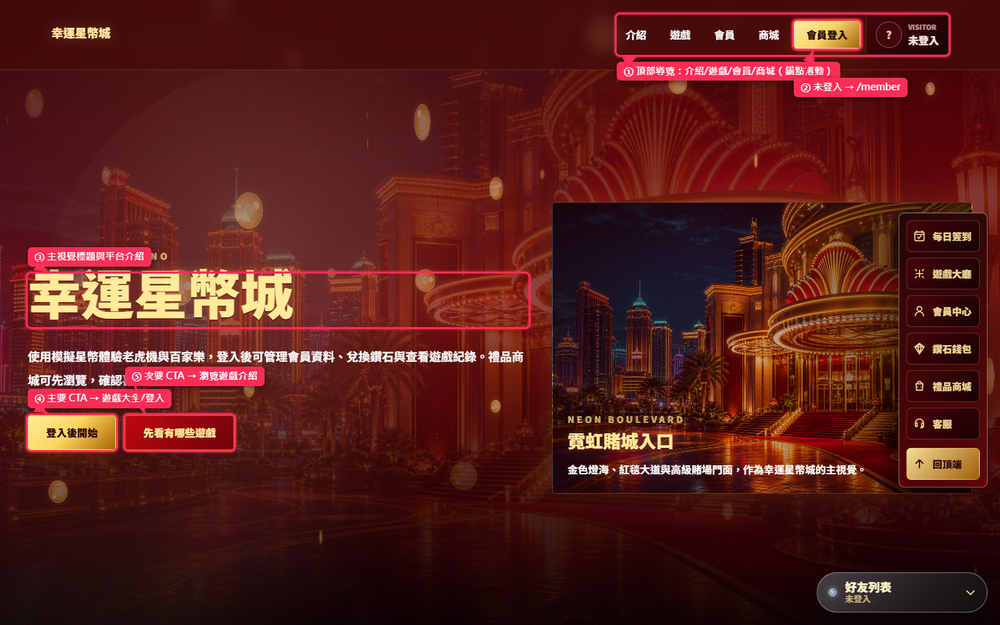

| 編號 | 功能 | 行為 / API |
|---|---|---|
| ① | 頂部導覽 | 錨點捲動：介紹 / 遊戲 / 會員 / 商城 |
| ② | 會員登入 | 未登入 → `/member`；已登入顯示頭像 → `/profile` |
| ③ | 主視覺標題 | 平台介紹 |
| ④⑤ | 主/次 CTA | 「查看遊戲大全 / 開始遊玩」、「先看有哪些遊戲」 |

**遊戲介紹區（#games）**

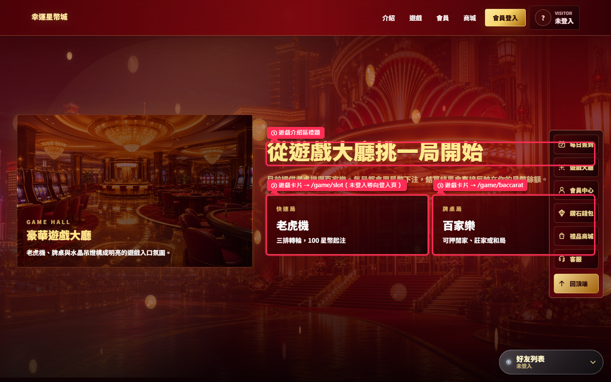

| 編號 | 功能 | 行為 / API |
|---|---|---|
| ① | 區塊標題 | 「從遊戲大廳挑一局開始」 |
| ②③ | 遊戲卡片 | → `/game/slot`、`/game/baccarat`（未登入導向登入頁） |

**會員區（#member）**

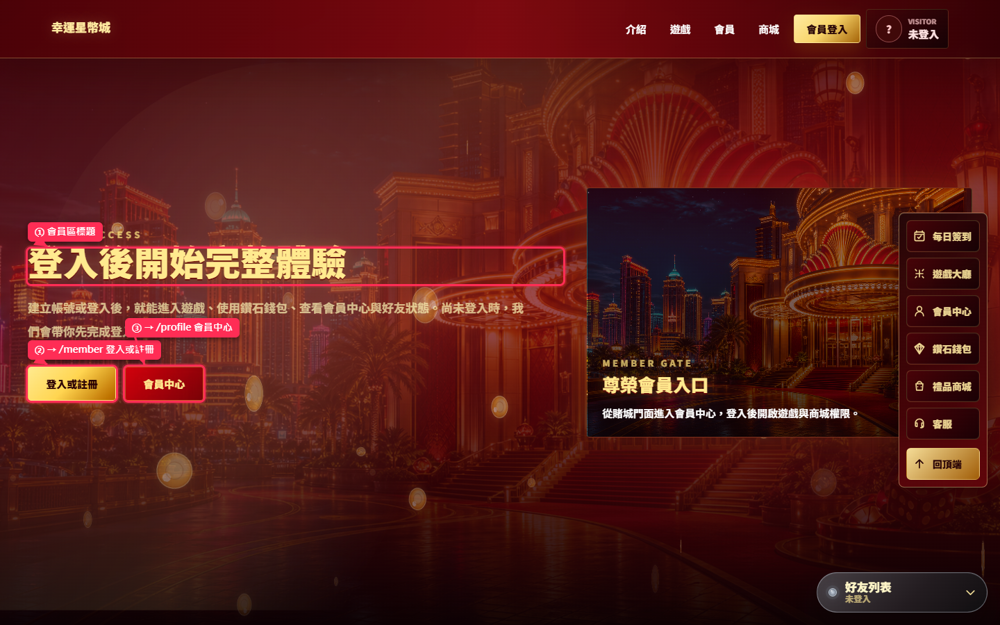

| 編號 | 功能 | 行為 / API |
|---|---|---|
| ① | 區塊標題 | 「登入後開始完整體驗」 |
| ② | 登入或註冊 | → `/member` |
| ③ | 會員中心 | → `/profile`（未登入導向登入頁） |

**商城區（#shop）**

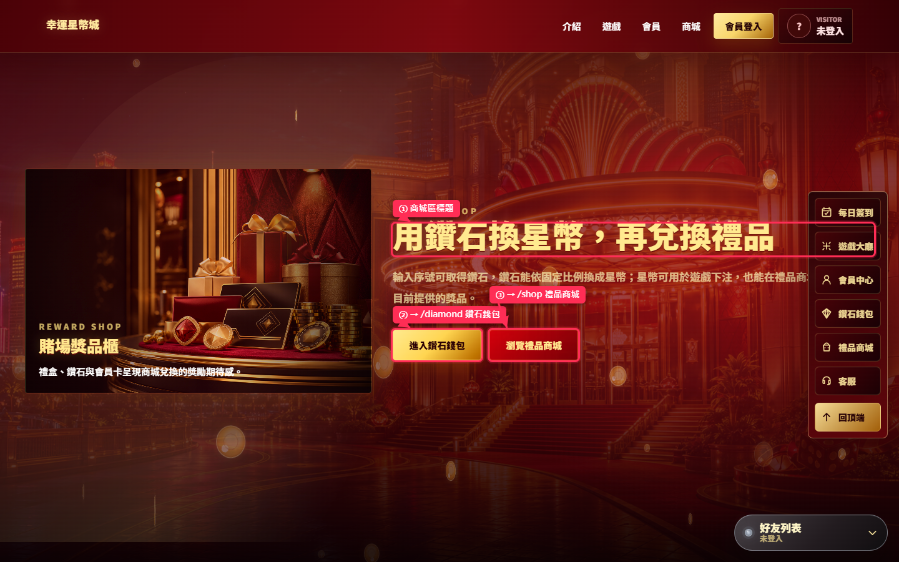

| 編號 | 功能 | 行為 / API |
|---|---|---|
| ① | 區塊標題 | 「用鑽石換星幣，再兌換禮品」 |
| ② | 進入鑽石錢包 | → `/diamond` |
| ③ | 瀏覽禮品商城 | → `/shop` |

### 5.2 登入 `/member?mode=login`（公開）

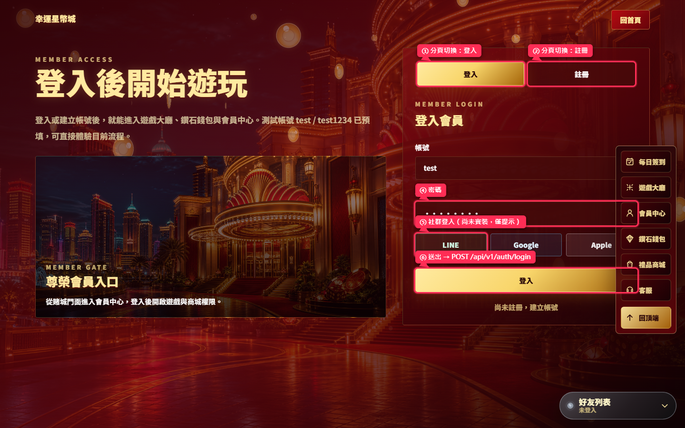

| 編號 | 功能 | 行為 / API |
|---|---|---|
| ①② | 登入／註冊分頁 | 切換並更新 URL query `?mode=` |
| ③ | 帳號 | 預填測試帳號 `test` |
| ④ | 密碼 | 預填 `test1234` |
| ⑤ | 社群登入 | LINE / Google / Apple — **未實裝**，僅顯示提示 |
| ⑥ | 登入送出 | `POST /api/v1/auth/login`；成功後同步錢包/鑽石/排行 → `/games` |

### 5.3 註冊 `/member?mode=register`（公開）

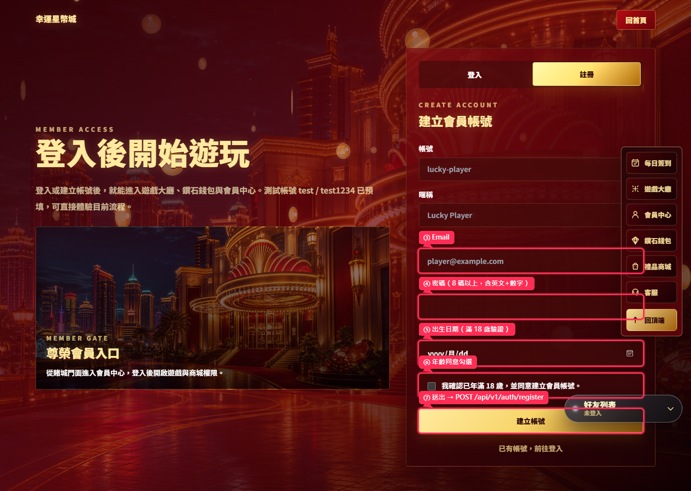

| 編號 | 功能 | 行為 / API |
|---|---|---|
| ① | 帳號 | 至少 3 碼 |
| ② | 暱稱 | 至少 2 碼 |
| ③ | Email | 格式驗證 |
| ④ | 密碼 | 8 碼以上、英文 + 數字 |
| ⑤ | 出生日期 | 前端驗證滿 18 歲 |
| ⑥ | 年齡同意 | 必勾 |
| ⑦ | 建立帳號 | `POST /api/v1/auth/register` → 自動登入 → `/games` |

### 5.4 每日簽到彈窗（登入後自動彈出，每日一次）

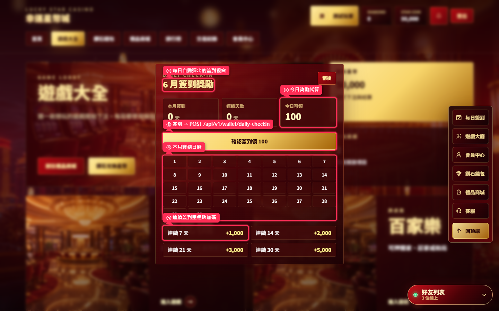

| 編號 | 功能 | 行為 / API |
|---|---|---|
| ① | 簽到視窗 | 當日未簽到時自動開啟（記錄在 localStorage） |
| ② | 今日可領 | 100 星幣 + 連續里程碑加碼試算 |
| ③ | 確認簽到 | `POST /api/v1/wallet/daily-checkin` |
| ④ | 本月日曆 | 已簽到日期亮起 |
| ⑤ | 里程碑 | 連續 7/14/21/30 天加碼 +1000~+5000 |

### 5.5 遊戲大廳 `/games`（受保護）— 含共用頂欄

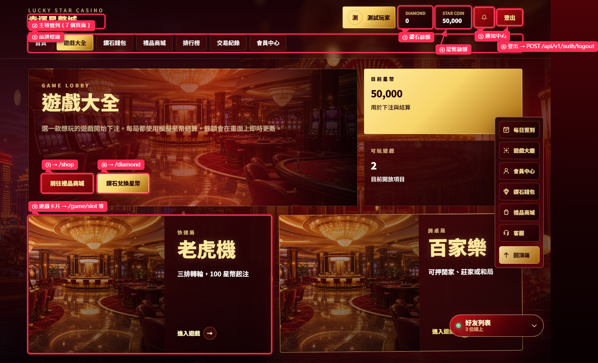

| 編號 | 功能 | 行為 / API |
|---|---|---|
| ① | 品牌標題 | 共用 AppShell 頂欄 |
| ② | 主導覽列 | 首頁 / 遊戲大全 / 鑽石錢包 / 禮品商城 / 排行榜 / 交易紀錄 / 會員中心 |
| ③④ | 鑽石、星幣餘額 | `GET /api/v1/wallet/diamond/balance`、`GET /api/v1/wallet/balance` |
| ⑤ | 通知中心 | WebSocket 推播清單（RealtimeBridge） |
| ⑥ | 登出 | `POST /api/v1/auth/logout`（JWT 加入黑名單） |
| ⑦⑧ | 快捷按鈕 | → `/shop`、`/diamond` |
| ⑨ | 遊戲卡片 | → `/game/slot`、`/game/baccarat` |

### 5.6 老虎機 `/game/slot`（受保護）

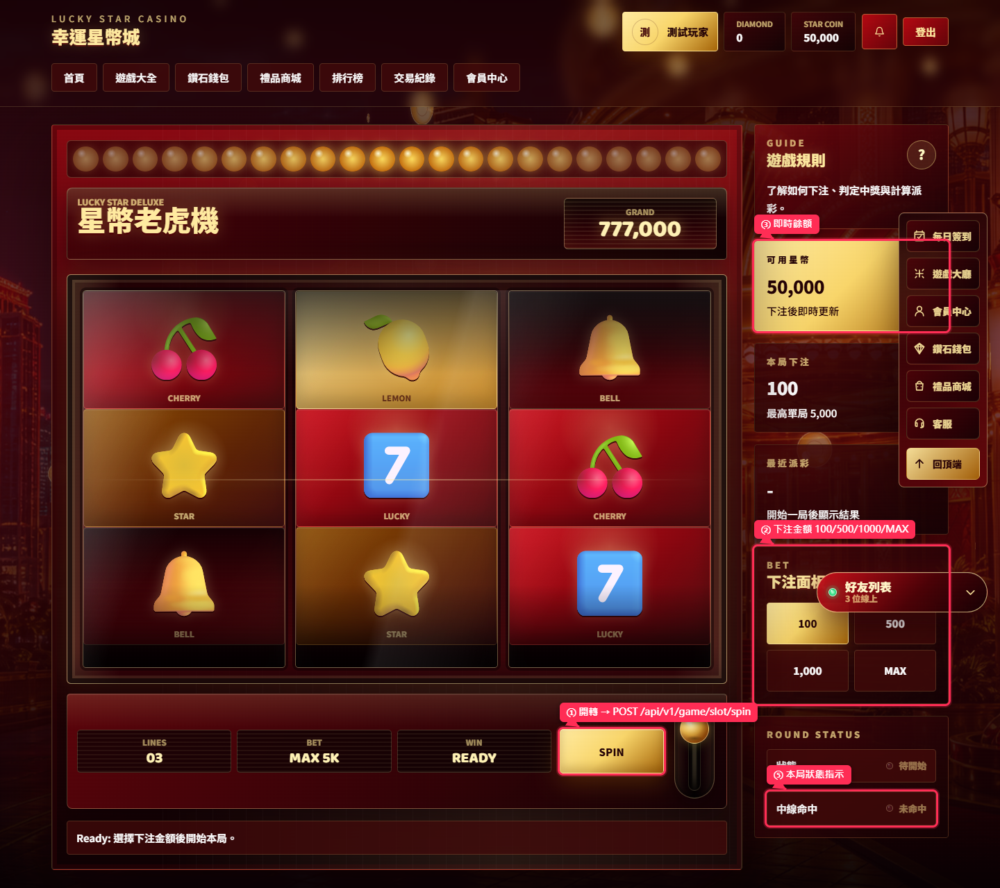

| 編號 | 功能 | 行為 / API |
|---|---|---|
| ① | SPIN | 下注 + 轉動（後端對應 `POST /api/v1/game/slot/spin`；目前前端介接 mock） |
| ② | 下注面板 | 100 / 500 / 1000 / MAX（MAX = min(餘額, 5000)） |
| ③ | 可用星幣 | 即時餘額 |
| ④ | 規則卡 | 3×3 盤面中線命中，派彩 2x / 3x / 5x / 8x |
| ⑤ | 局況指示 | 待開始 / 轉動中 / 已結算、中線命中與否 |

### 5.7 百家樂 `/game/baccarat`（受保護）

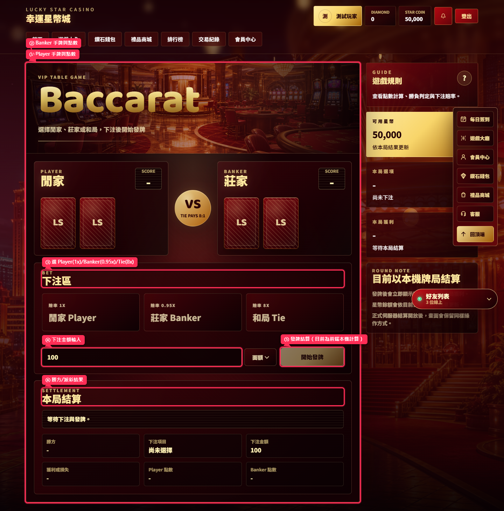

| 編號 | 功能 | 行為 / API |
|---|---|---|
| ①② | 閒家 / 莊家手牌 | 發牌動畫 + 點數顯示 |
| ③ | 下注區 | 閒 1x ／ 莊 0.95x ／ 和 8x |
| ④ | 下注金額 | 手動輸入 + 8 種快速面額 |
| ⑤ | 開始發牌 | ⚠️ 目前為**前端本機結算**（後端 `/bet` + `/result` API 已完成、待串接） |
| ⑥ | 本局結算 | 勝方、下注、獲利、雙方點數 |

### 5.8 鑽石錢包 `/diamond`（受保護）

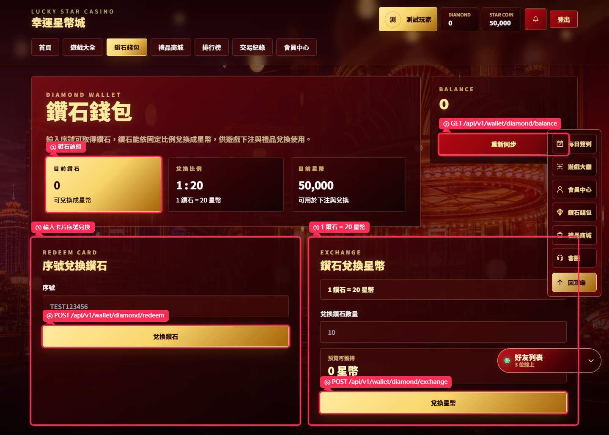

| 編號 | 功能 | 行為 / API |
|---|---|---|
| ① | 目前鑽石 | 餘額顯示 |
| ② | 重新同步 | `GET /api/v1/wallet/diamond/balance` |
| ③④ | 序號兌換鑽石 | `POST /api/v1/wallet/diamond/redeem`（測試序號 `TEST123456`） |
| ⑤⑥ | 鑽石兌換星幣 | `POST /api/v1/wallet/diamond/exchange`（1 鑽石 = 20 星幣，含即時預覽） |

### 5.9 禮品商城 `/shop`（公開）

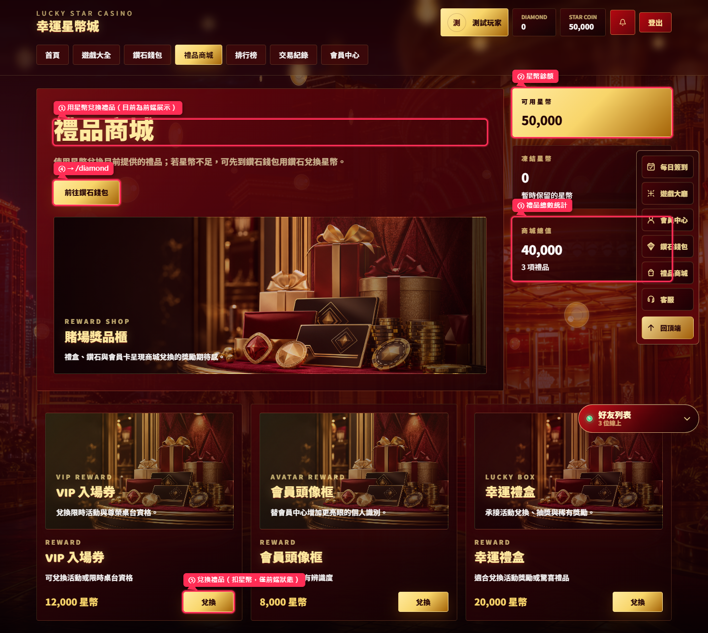

| 編號 | 功能 | 行為 / API |
|---|---|---|
| ① | 商城標題 | 星幣兌換禮品 |
| ②③ | 星幣餘額、商城統計 | 餘額不足時兌換鈕反灰 |
| ④ | 前往鑽石錢包 | → `/diamond` |
| ⑤ | 兌換 | ⚠️ 目前僅前端扣餘額 state，**無後端 API** |

### 5.10 排行榜 `/rank`（受保護）

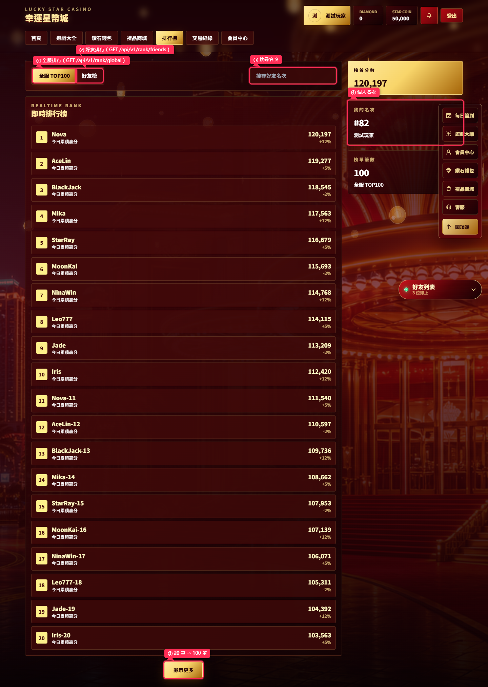

| 編號 | 功能 | 行為 / API |
|---|---|---|
| ①② | 全服 TOP100 / 好友榜 | `GET /api/v1/rank/global`、`GET /api/v1/rank/friends` |
| ③ | 搜尋 | 以暱稱過濾名次 |
| ④ | 我的名次 | `GET /api/v1/rank/global/{playerId}` |
| ⑤ | 顯示更多 | 20 筆 → 100 筆 |

### 5.11 會員中心 `/profile`（受保護）

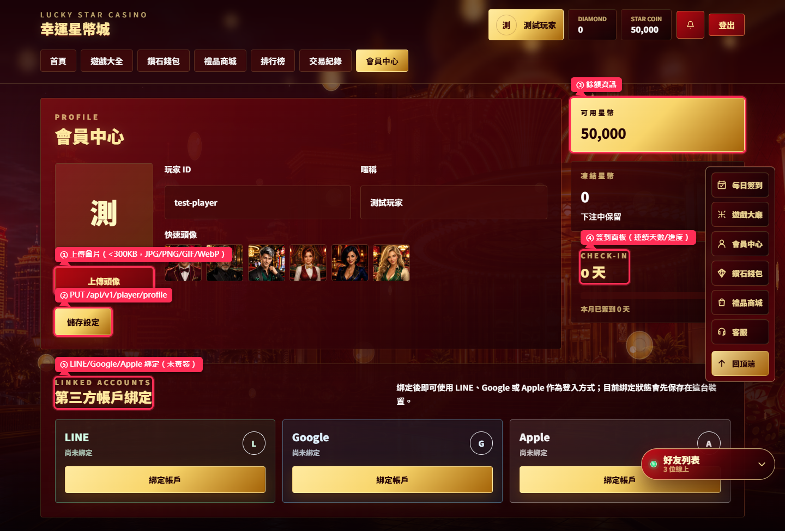

| 編號 | 功能 | 行為 / API |
|---|---|---|
| ① | 上傳頭像 | 限 JPG/PNG/GIF/WebP、<300KB，轉 dataURL |
| ② | 儲存設定 | `PUT /api/v1/player/profile`（暱稱 + 頭像） |
| ③ | 餘額資訊 | 可用 / 凍結星幣 |
| ④ | 簽到面板 | 連續天數、進度條、月曆 popup、立即簽到 |
| ⑤ | 第三方綁定 | LINE / Google / Apple — **未實裝**（僅 localStorage 狀態） |

### 5.12 交易紀錄 `/transactions`（受保護）

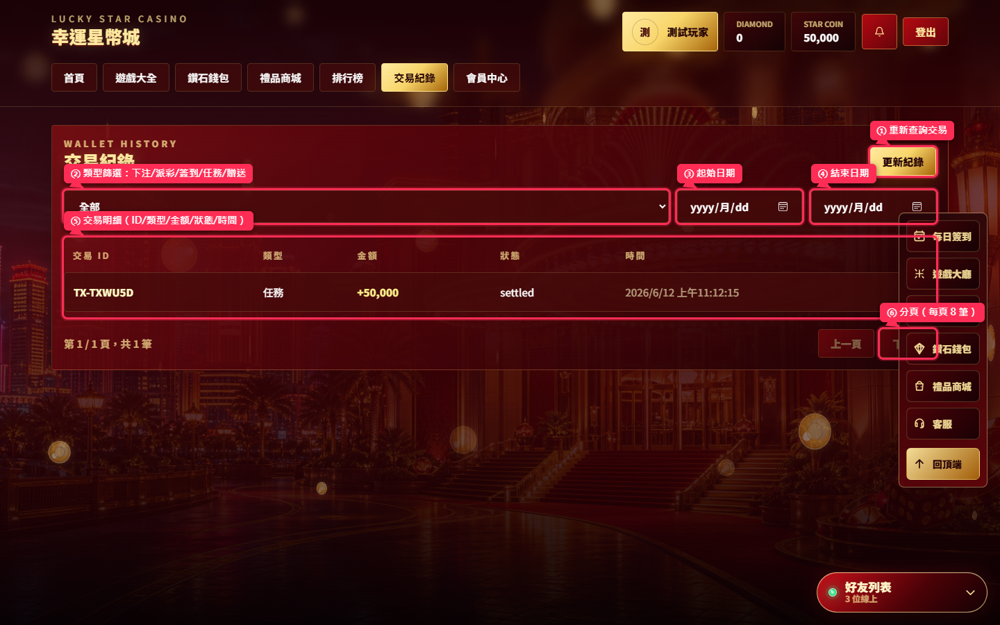

| 編號 | 功能 | 行為 / API |
|---|---|---|
| ① | 更新紀錄 | 重新查詢 |
| ② | 類型篩選 | 全部 / 下注 / 派彩 / 簽到 / 任務 / 贈送 |
| ③④ | 日期區間 | 起訖篩選 |
| ⑤ | 明細表 | 交易 ID / 類型 / 金額（+黃 −紅）/ 狀態 / 時間 |
| ⑥ | 分頁 | 每頁 8 筆 |

### 5.13 每日簽到頁 `/check-in`（受保護）

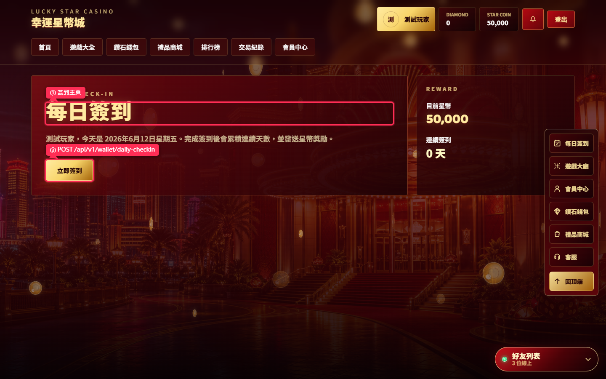

| 編號 | 功能 | 行為 / API |
|---|---|---|
| ① | 簽到主頁 | 顯示玩家與今日日期（台灣時區） |
| ② | 立即簽到 | `POST /api/v1/wallet/daily-checkin` → 重新抓 profile + 錢包 |
| ③④ | 目前星幣 / 連續天數 | 簽到獎勵摘要 |

