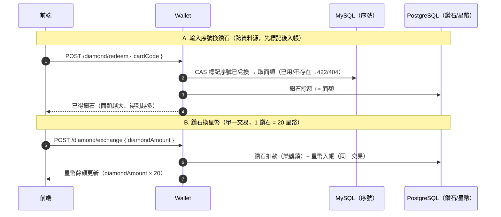

# 幸運星幣城（Lucky Star Casino）— 補充說明

> 產出日期：2026-06-16 ｜ 範圍：本次特別要求詳細／條列說明的系統，以及過程中發現並處理的問題。
> 對應主報告：機制詳見《開發與流程報告》§4.7–§4.10、前端畫面見《前端功能導覽》§5.14、除錯見《系統總體檢報告》§6.1 F-4。
> 同名 `.html` 用瀏覽器開啟 → 列印 → 另存 PDF。

---

## 目錄

1. [鑽石系統（序號生成與兌換）](#1-鑽石系統序號生成與兌換)
2. [破產補助（機制＋畫面＋操作教學）](#2-破產補助機制畫面操作教學)
3. [公平性驗證是什麼（條列）](#3-公平性驗證是什麼條列)
4. [Redis 7 的 Token / 黑名單（條列）](#4-redis-7-的-token--黑名單條列)
5. [本次發現並處理的問題](#5-本次發現並處理的問題)
6. [本 Session 新增任務](#6-本-session-新增任務)

---

## 1. 鑽石系統（序號生成與兌換）

本平台是**雙錢包**：星幣（遊戲下注用）＋鑽石（入金代幣）。玩家無真實金流，鑽石只能透過「點數卡序號」取得，再換成星幣。整條鏈是：**輸入序號 → 得到該卡面額的鑽石 → 鑽石按 1:20 換星幣**；卡面額不同，最終換得的星幣額度就不同。

### (1) 序號生成（後台，許銘仁，T-105 / T-106）

- 程式：admin-service `DiamondCardService.generateCards(count, faceValue)`，寫入 MySQL `diamond_cards`（`card_code` UNIQUE）。
- 序號格式：`XXXX-XXXX-XXXX-XXXX`——取 `UUID` 去掉連字號後的前 16 碼 hex、轉大寫，每 4 碼一段。
- 唯一性兩道保障：同批以 `LinkedHashSet` 去重 ＋ `existsByCardCode` 避開資料庫既有序號。
- **不同額度**：每張卡帶 `face_value`（= 可兌換的鑽石數）。後台生成時指定面額，因此可批量產出 100／500／1000 鑽石等不同額度的卡。

### (2) 序號兌換鑽石（T-102，`POST /api/v1/wallet/diamond/redeem`）

跨資料源操作（序號在 MySQL、鑽石餘額在 PostgreSQL），刻意不引入 XA，改以「先標記、再入帳、失敗補償」串接：

- ① **序號 CAS 標記**（`DiamondCardService.redeemCard`，MySQL 條件式 UPDATE）：原子地把序號標記為已兌換並取回面額。防重複兌換的關卡——序號不存在 → 404；已兌換或並發落敗 → 422。
- ② **鑽石入帳**（`DiamondWalletService.creditDiamond`，PostgreSQL）：面額加進鑽石餘額。
- ③ **補償**：入帳失敗則回滾序號標記讓玩家重試（`DiamondRedeemService` 協調）。

### (3) 鑽石兌換星幣（T-103，`POST /api/v1/wallet/diamond/exchange`）

- 比例固定 **1 鑽石 = 20 星幣**（`DiamondExchangeService.EXCHANGE_RATE`）。
- 整筆在**單一 PostgreSQL 交易**內完成：冪等預檢（key `diamond-exchange:{idempotencyKey}`）→ 鑽石扣款（樂觀鎖）→ 星幣入帳（同交易、子類型 `DIAMOND_EXCHANGE`）。同交易天然原子，星幣入帳失敗時鑽石扣款一起回滾，無需補償。

> 重點回答：「使用者輸入序號後可以轉成不同額度的星幣」靠的是**卡面額（face_value）**——後台生成時給不同面額 → 兌換得到不同鑽石數 → 再按固定 1:20 換成不同額度的星幣。

---

## 2. 破產補助（機制＋畫面＋操作教學）

防流失機制：玩家輸光時可領救濟金繼續遊玩。後端 `BankruptcyAidService.claim`，對應 `POST /api/v1/wallet/bankruptcy-aid`（T-027 早已完成，**前端原本沒有入口**，本次補上）。

### 機制

- **資格**：以**總餘額**（非可用餘額）低於 **100** 判定；否則 422。用總餘額是刻意設計——可用餘額 = 總餘額 − 凍結金額，若用可用餘額判定，玩家可把錢凍結在未結算下注上壓低可用餘額來騙補助。
- **每日一次**：Redis 當日鎖 `SET wallet:bankruptcy-aid:{playerId}:{date} 1 NX`，TTL 到當地（台北）午夜；搶不到代表今天已領 → 422。
- **入帳**：固定發放 **1,000 星幣**，冪等鍵 `bankruptcy-aid:{playerId}:{date}` 為 DB 第二道防線（Redis 即使被清空，同日也不會重複入帳）。

### 前端畫面（本次新增：頭像下拉 →「客服說明」）

<svg viewBox="0 0 640 360" xmlns="http://www.w3.org/2000/svg" style="max-width:640px;font-family:sans-serif">
<rect x="2" y="2" width="636" height="356" fill="#fff" stroke="#888"/>
<rect x="2" y="2" width="636" height="34" fill="#eee" stroke="#888"/>
<text x="14" y="24" font-size="11" fill="#444">共用頂欄</text>
<rect x="470" y="8" width="86" height="20" fill="#ddd" stroke="#999"/><text x="478" y="22" font-size="9" fill="#555">👤 玩家暱稱 ▾</text>
<rect x="560" y="8" width="40" height="20" fill="#ccc" stroke="#999"/><text x="568" y="22" font-size="9" fill="#555">登出</text>
<rect x="470" y="32" width="130" height="40" fill="#fafafa" stroke="#c00"/>
<text x="480" y="50" font-size="10" fill="#555">客服說明</text>
<rect x="556" y="40" width="40" height="14" fill="#ffd54f" stroke="#c89b00"/><text x="560" y="51" font-size="8" fill="#7a5b00">可領補助</text>
<text x="608" y="50" font-size="11" fill="#c00" font-weight="bold">①</text>
<rect x="120" y="96" width="400" height="240" fill="#f7f7f7" stroke="#999"/>
<rect x="120" y="96" width="400" height="34" fill="#eee" stroke="#999"/>
<text x="134" y="118" font-size="13" fill="#333">客服說明</text>
<rect x="476" y="102" width="36" height="20" fill="#ccc" stroke="#999"/><text x="484" y="116" font-size="9" fill="#555">關閉</text>
<rect x="138" y="144" width="364" height="176" fill="#fafafa" stroke="#999"/>
<text x="150" y="166" font-size="12" fill="#333">破產補助金</text>
<text x="610" y="166" font-size="11" fill="#c00" font-weight="bold">②</text>
<text x="150" y="186" font-size="9" fill="#666">餘額低於 100 時，每天可免費領取一次救濟金</text>
<text x="150" y="206" font-size="9" fill="#666">1. 確認星幣餘額低於 100</text>
<text x="150" y="220" font-size="9" fill="#666">2. 點擊「領取破產補助」</text>
<text x="150" y="234" font-size="9" fill="#666">3. 發放 1,000 星幣並更新餘額；每日限領一次</text>
<rect x="150" y="246" width="340" height="26" fill="#fff" stroke="#999"/><text x="160" y="263" font-size="9" fill="#555">目前星幣</text><text x="450" y="263" font-size="10" fill="#333">80</text>
<text x="610" y="263" font-size="11" fill="#c00" font-weight="bold">③</text>
<rect x="150" y="280" width="340" height="28" fill="#ffd54f" stroke="#c89b00"/><text x="270" y="298" font-size="11" fill="#7a5b00">領取破產補助（+1,000）</text>
<text x="610" y="298" font-size="11" fill="#c00" font-weight="bold">④</text>
</svg>

| 編號 | 功能 | 行為 / API |
|---|---|---|
| ① | 頭像下拉 → 客服說明 | 點頭像展開選單；餘額 < 100 時顯示「可領補助」標記 |
| ② | 破產補助說明卡 | 條列操作教學（資格、步驟、每日一次） |
| ③ | 目前星幣 | 即時餘額，用來判斷是否符合資格 |
| ④ | 領取破產補助 | `POST /api/v1/wallet/bankruptcy-aid`；餘額 ≥ 100 時反灰停用、領取後即時更新餘額 |

### 操作教學（條列）

1. 點右上角**頭像**展開下拉選單，選「**客服說明**」。
2. 在「破產補助金」卡片確認**目前星幣低於 100**（若 ≥ 100，按鈕停用並提示「餘額需低於 100 才可領取」）。
3. 點「**領取破產補助（+1,000）**」。
4. 系統發放 1,000 星幣、即時更新頂欄餘額，並顯示「已領取破產補助 1,000 星幣」。
5. **每日限領一次**；當天再領會提示「今日已領取過破產補助」。

---

## 3. 公平性驗證是什麼（條列）

> 對應「黃崇瑜 負責的公平性驗證」（T-036）。一句話：**讓玩家能自己驗算某一局結果沒有被竄改**。賭場遊戲最怕「莊家偷改開獎」，這套機制用密碼學承諾把公平性變成「任何人都可查核」。

- **核心：commit-reveal 三步**（`ProvablyFairRng`）：
  1. **commit（開局前）**：伺服器產生保密的 `serverSeed`（32 bytes），對外只公布它的雜湊 `serverSeedHash = SHA-256(serverSeed)`。雜湊先鎖定，事後無法替換種子。
  2. **play（下注時）**：用 `(serverSeed, clientSeed, nonce)` 三元組推導結果——`clientSeed` 玩家可自帶、`nonce` 逐筆遞增。**相同三元組必產生相同結果**（確定性），這是可驗證的基礎。
  3. **reveal（結算後）**：揭露 `serverSeed`，玩家即可自行查核。
- **驗證 API**（`VerificationService`，`GET /api/v1/game/verify/{roundId}?serverSeed=…`）一次判定兩件事：
  - **承諾相符**：`SHA-256(serverSeed) == serverSeedHash` → 確認種子在下注前就鎖定、沒被事後替換。
  - **結果一致**：用三元組**重跑遊戲引擎**（老虎機盤面／百家樂牌局與派彩），逐欄與 `game_rounds` 紀錄比對。
  - 兩者皆過才回 `valid=true`：「本局公平未遭竄改」；任一不過則指出是「承諾不符」或「結果疑遭竄改」。
- **防時序攻擊**：雜湊比較用 `MessageDigest.isEqual`（常數時間），避免從比較耗時推測內容。
- **特性**：唯讀、不動帳務；玩家也可不依賴本服務、用相同公式自行重算。

---

## 4. Redis 7 的 Token / 黑名單（條列）

> 對應技術表「Redis 7 — Token／黑名單」。Redis 在本系統承擔 Token、遊戲 Session、排行榜 ZSet 三類資料；本節聚焦 Token 與黑名單。

- **Refresh Token**（member-service `TokenRedisService`）：
  - 登入時把 refresh token 存 `refresh:{memberId}`，TTL 7 天。
  - `POST /api/v1/auth/refresh` 會比對 Redis 內的 refresh token 才換發新的 access token；登出時刪除。
- **JWT 黑名單（登出即時撤銷）**：
  - access token 是**無狀態 JWT**（HMAC-SHA256 簽章 + 15 分到期），伺服器不保存。問題是「登出後到自然到期前」這段時間 token 仍簽章有效，因此需要黑名單**主動撤銷**。
  - 登出（`AuthService.logout`）把該 token 的 `jti`（JWT ID）寫進黑名單 key `jwt:blacklist:{jti}`，TTL = token 剩餘壽命（到期自動清除、不佔空間）。
  - **Gateway 每個請求**驗章後查 `jwt:blacklist:{jti}`，命中 → 401；另查 `disabled:player:{sub}`（後台停用玩家）→ 401。
  - **fail-closed**：Redis 故障時一律拒絕（視同已撤銷），避免黑名單失效讓已登出的 token「復活」。

---

## 5. 本次發現並處理的問題

| # | 嚴重度 | 問題 | 處理 | 狀態 |
|---|---|---|---|---|
| 1 | 🔴 高 | **登出黑名單前綴不一致**：member 寫 `blacklist:{jti}`、Gateway 查 `jwt:blacklist:{jti}`，對不上 → 登出後 token 在自然到期前於 Gateway 端仍可通行，撤銷形同未生效 | 將 member `TokenRedisService` 前綴統一為 `jwt:blacklist:`，並加註解鎖定兩處須同步；`mvn -pl backend/member-service test` 70 tests 全綠 | ✅ 已修（報告 §6.1 F-4） |
| 2 | 🟡 低 | **「客服」入口重複**：本次破產補助入口做在「頭像下拉 → 客服說明」，但浮動工具列 `QuickToolbar.jsx` 仍有一顆舊「客服」按鈕（顯示「客服入口準備中」stub） | 把客服說明彈窗抽成 App 根層 `SupportModal`、以 `uiSlice` 控制開關；頭像下拉與工具列「客服」現導向同一彈窗，行為一致（首頁等未掛載 AppShell 的頁面也可用） | ✅ 已完成（見 T-114） |

---

## 6. 本 Session 新增任務

> 以下為本次 session 實際執行/新增的工作項；編號為**暫定**（接續工作分配表 T-107 之後），如需正式納管請更新 `docs/幸運星幣城_工作分配表.xlsx`。

| 暫定編號 | 任務 | 類型 | 負責模組 | 狀態 |
|---|---|---|---|---|
| T-108 | 報告組員代號改真名（張鈞皓（組長）/黃崇瑜/林瑋彧/許銘仁/王竣揚）＋王竣揚前端工作暫代註記 | docs | 提案書 | ✅ 完成 |
| T-109 | 鑽石系統（序號生成與兌換、不同額度換星幣）詳細說明 | docs | 報告 §4.7 | ✅ 完成 |
| T-110 | 破產補助前端入口實作（頭像下拉「客服說明」彈窗＋領取，串 `POST /api/v1/wallet/bankruptcy-aid`，含 mock） | frontend | AppShell / walletApi / walletSlice / mockApi | ✅ 完成 |
| T-111 | 破產補助前端畫面（線框）與操作教學 | docs | 報告 §5.14 | ✅ 完成 |
| T-112 | 公平性驗證、Redis 7 Token/黑名單 條列說明 | docs | 報告 §4.9、§4.10 | ✅ 完成 |
| T-113 | 登出黑名單前綴對齊修正（F-4） | fix(backend) | member-service / gateway-service | ✅ 完成 |
| T-114 | 浮動工具列「客服」按鈕統一導向「客服說明」彈窗（抽出 SupportModal＋uiSlice） | frontend | QuickToolbar / SupportModal / uiSlice / App / AppShell | ✅ 完成 |

---

> 驗證紀錄：`mvn -pl backend/member-service test` BUILD SUCCESS（70 tests）；前端 `npm run lint` 無錯、`npm run build` 成功（含 T-114 SupportModal/uiSlice 重構後再次綠燈）；報告 `build-split.mjs`＋`build-html.mjs`＋`make-pdf.mjs` 皆成功；工作分配表 xlsx 已將代號全面改真名並新增 T-108~T-114 七列。詳見根目錄 `CHANGELOG.md`（2026-06-16 條目）。
