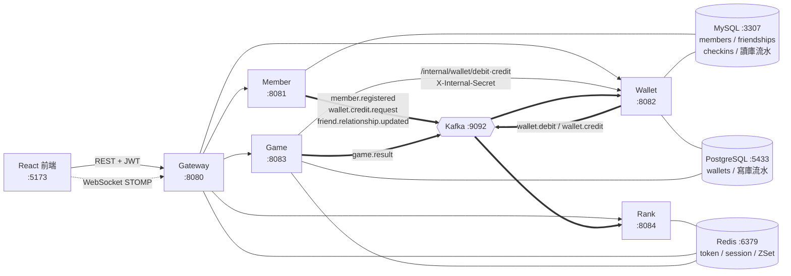
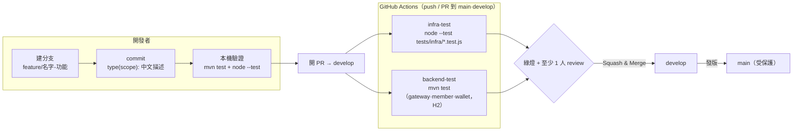
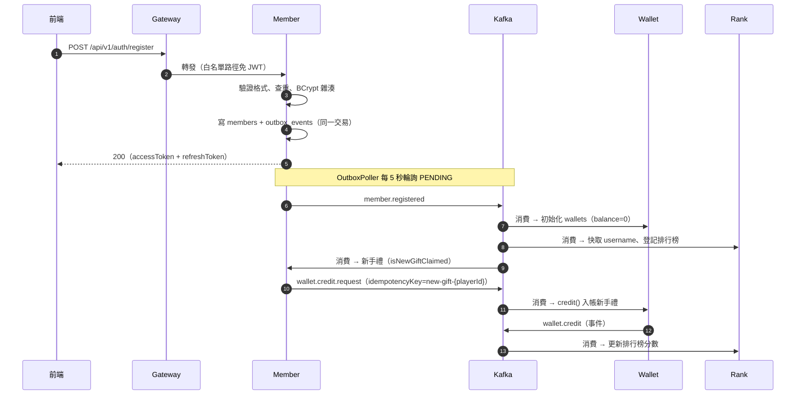
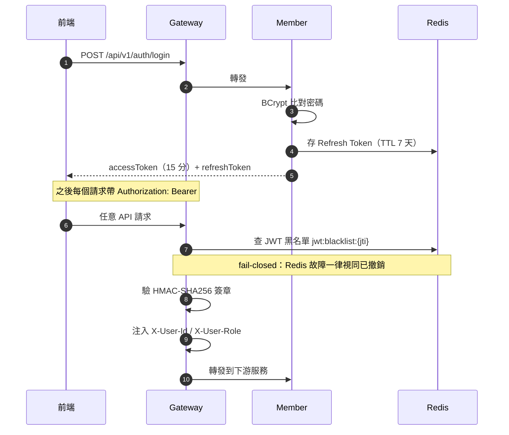
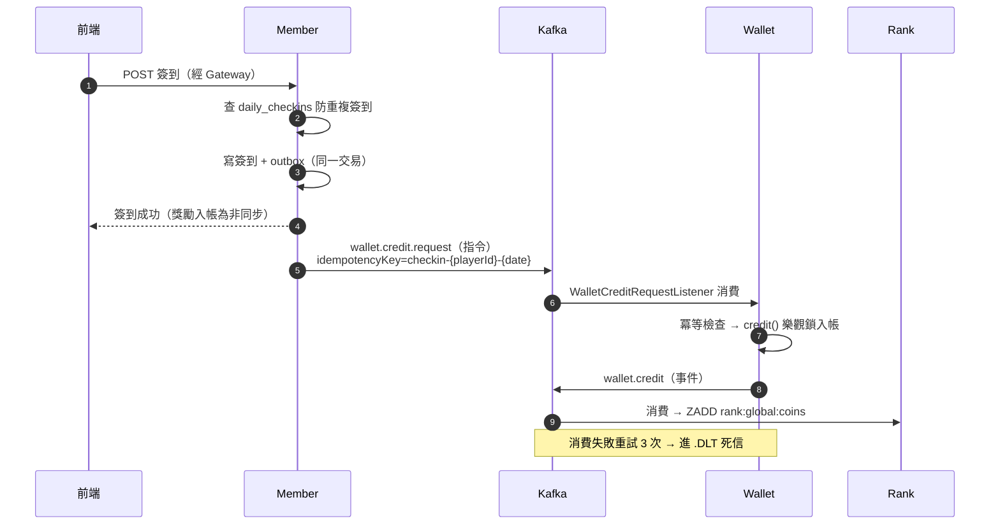
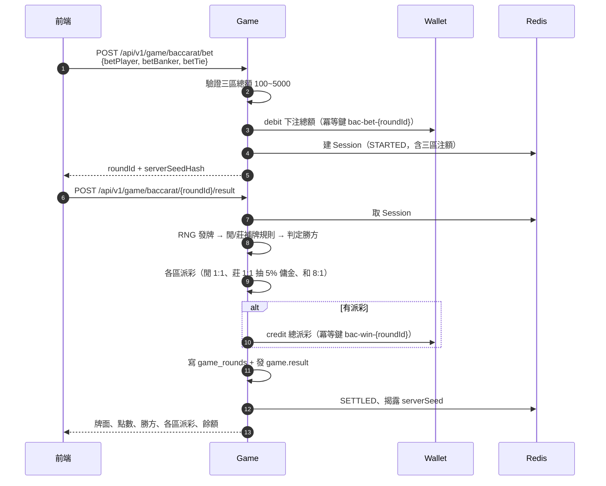
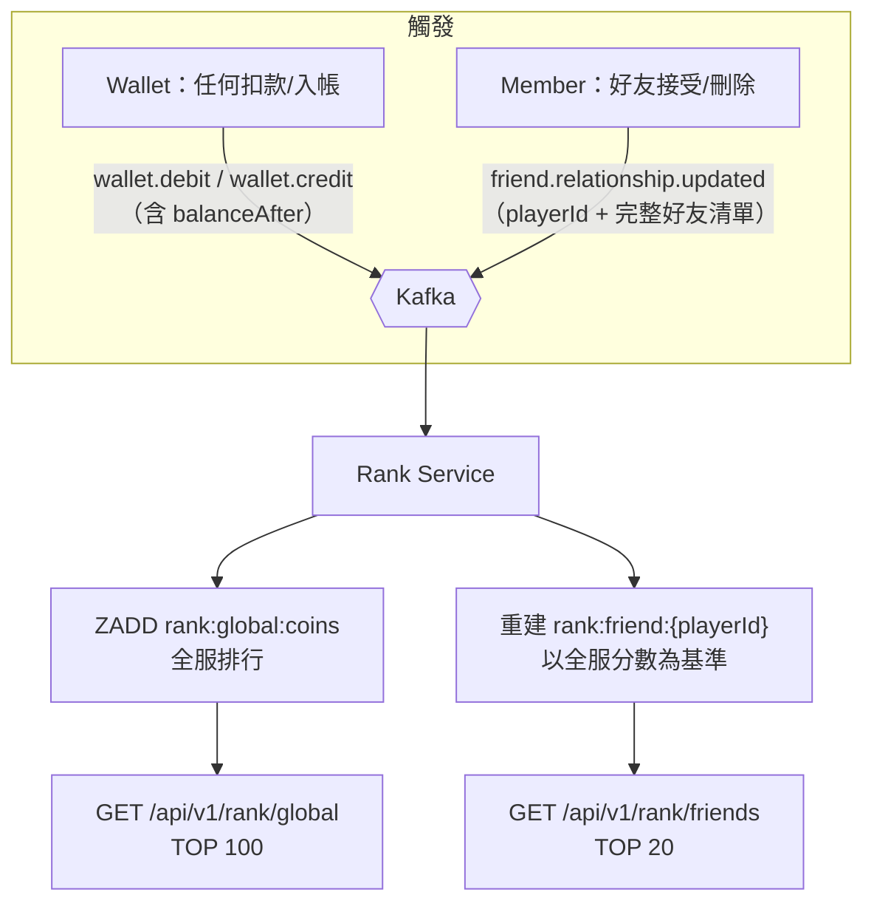
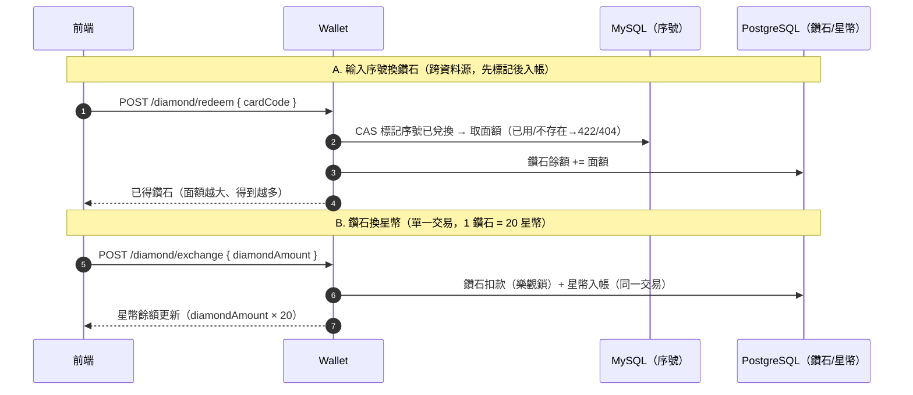

# 幸運星幣城（Lucky Star Casino）— 開發與流程報告

> 產出日期：2026-06-12 ｜ 範圍：專案概覽、系統架構、開發/業務工作流程（Mermaid）、除錯報告。前端逐頁功能導覽另見《前端功能導覽》分冊。
> 同名 `.html` 用瀏覽器開啟 → 列印 → 另存 PDF。

---

## 目錄

1. [專案概覽](#1-專案概覽)
2. [系統架構圖](#2-系統架構圖)
3. [開發工作流程（Git / CI）](#3-開發工作流程git--ci)
4. [核心業務工作流程](#4-核心業務工作流程)
   - 4.1 [玩家註冊（Outbox + Kafka）](#41-玩家註冊outbox--kafka)
   - 4.2 [登入與 JWT 驗證](#42-登入與-jwt-驗證)
   - 4.3 [每日簽到入帳（指令/事件分離）](#43-每日簽到入帳指令事件分離)
   - 4.4 [老虎機兩階段 Commit-Ahead](#44-老虎機兩階段-commit-ahead)
   - 4.5 [百家樂下注與結算](#45-百家樂下注與結算)
   - 4.6 [排行榜即時更新與好友榜](#46-排行榜即時更新與好友榜)
   - 4.7 [鑽石系統（序號生成與兌換）](#47-鑽石系統序號生成與兌換)
   - 4.8 [破產補助金](#48-破產補助金t-027)
   - 4.9 [公平性驗證是什麼](#49-公平性驗證是什麼provably-fair黃崇瑜t-036)
   - 4.10 [Redis 7 的 Token / 黑名單](#410-redis-7-的-token--黑名單)
5. 前端頁面功能導覽 →（獨立分冊《前端功能導覽》）
6. [除錯報告（Debugging）](#6-除錯報告debugging)
   - 6.1 [本次已修復的 Bug](#61-本次已修復的-bug)
   - 6.2 [已確認待處理問題（依嚴重度）](#62-已確認待處理問題依嚴重度)
   - 6.3 [調查後排除的誤報](#63-調查後排除的誤報)
   - 6.4 [安全性觀察](#64-安全性觀察)
7. [附錄](#7-附錄)

---

## 1. 專案概覽

線上賭場（模擬幣，無真實金流）後端微服務系統，Monorepo（Maven 多模組）+ React 18 前端。

| 項目 | 內容 |
|---|---|
| 後端 | Java 21、Spring Boot 3.3.5、Spring Cloud Gateway、JJWT 0.12.6，套件根 `com.luckystar` |
| 前端 | React 18.3 + Vite 5 + Redux Toolkit + Tailwind CSS + STOMP WebSocket |
| 資料庫 | PostgreSQL 16（帳務寫庫，Port 5433）+ MySQL 8（查詢讀庫，Port 3307）＝ CQRS |
| 快取/事件 | Redis 7（token / session / 排行榜 ZSet）、Kafka（8 topics + 5 DLT） |

**服務一覽與完成度**：

| 服務 | Port | 職責 | 狀態 |
|---|---|---|---|
| gateway-service | 8080 | JWT 驗證、黑名單、限流、路由 | ✅ 已實作（21 tests） |
| member-service | 8081 | 註冊/登入、好友、簽到、Outbox | ✅ 已實作（69 tests） |
| wallet-service | 8082 | 星幣帳務、冪等 + 樂觀鎖、雙資料源 | ✅ 已實作（142 tests） |
| game-service | 8083 | Provably Fair RNG、老虎機、百家樂、RTP | ✅ T-030~T-037 完成（106 tests） |
| rank-service | 8084 | 全服/好友排行榜（Redis ZSet） | ✅ T-040~T-042 完成（26 tests） |
| admin-service | 8086 | 後台管理 | ⬜ 空殼 |
| notification-service | – | 推播通知 | ⬜ 尚未建立 |

---

## 2. 系統架構圖

**設計重點**（詳見 `docs/adr/`）：

- **ADR-001 CQRS**：PostgreSQL 為帳務寫庫（樂觀鎖 `@Version` + `idempotency_key` UNIQUE），MySQL 為查詢讀庫，由 Kafka 事件同步。wallet-service 為雙資料源，EntityManagerFactory 手動建立。
- **ADR-002 指令/事件分離**：`wallet.credit.request` 是「請入帳」**指令**（member 發、wallet 消費）；`wallet.credit` 是「已入帳」**事件**（wallet 發、rank 消費）。wallet 絕不可消費 `wallet.credit`，否則無限迴圈。

---

## 3. 開發工作流程（Git / CI）

| 約定 | 內容 |
|---|---|
| 分支 | `feature/{名字}-{功能}`、`fix/…`、`docs/…`，一律 PR 進 `develop` |
| Commit | Conventional Commits：`feat(wallet-service): 中文描述` |
| CHANGELOG | 單一真相來源：根目錄 `CHANGELOG.md`，行為變更必記（含理由與驗證方式） |
| 本機驗證 | `mvn -pl backend/gateway-service,backend/member-service,backend/wallet-service test`、`node --test tests/infra/*.test.js` |

---

## 4. 核心業務工作流程

### 4.1 玩家註冊（Outbox + Kafka）

### 4.2 登入與 JWT 驗證

### 4.3 每日簽到入帳（指令/事件分離）

### 4.4 老虎機兩階段 Commit-Ahead

```mermaid
sequenceDiagram
    autonumber
    participant FE as 前端
    participant G as Game
    participant RD as Redis
    participant W as Wallet

    rect rgb(40, 24, 24)
    Note over FE,RD: 階段一：開局（不扣款、不洩漏種子）
    FE->>G: POST /api/v1/game/slot/round
    G->>G: 產生 serverSeed、計算 serverSeedHash
    G->>RD: 存 Session game:session:{playerId}:{roundId}<br/>state=STARTED、TTL 30 分
    G-->>FE: roundId + serverSeedHash（承諾）
    end

    rect rgb(24, 36, 24)
    Note over FE,W: 階段二：結算
    FE->>G: POST /round/{roundId}/settle
    G->>RD: 取 Session（不存在 → 404）
    G->>W: /internal/wallet/debit（冪等鍵 slot-bet-{roundId}）
    G->>G: RNG：SHA-256(serverSeed+clientSeed+nonce) → 盤面
    alt 中獎
        G->>W: /internal/wallet/credit（冪等鍵 slot-win-{roundId}）
    end
    G->>G: 寫 game_rounds（roundId 去重）+ 發 game.result
    G->>RD: Session → SETTLED、揭露 serverSeed
    G-->>FE: 盤面 + 派彩 + serverSeed（可驗證）
    end

    Note over FE,G: 事後驗證：GET /api/v1/game/verify/{roundId}?serverSeed=…
```

> 另有單次模式 `POST /api/v1/game/slot/spin`：一次呼叫完成扣款、轉動、派彩並同回應揭露 serverSeed（前端目前介接的入口）。

### 4.5 百家樂下注與結算

### 4.6 排行榜即時更新與好友榜

> ⚠️ 約定：`friend.relationship.updated` 帶的是**完整好友清單**，rank 整個重建好友 ZSet，不要改成增量事件（AGENTS.md 地雷 #11）。

### 4.7 鑽石系統（序號生成與兌換）

本平台是**雙錢包**：星幣（遊戲下注用）＋鑽石（入金代幣）。玩家無真實金流，鑽石只能透過「點數卡序號」取得，再換成星幣。整條鏈是：**輸入序號 → 得到該卡面額的鑽石 → 鑽石按 1:20 換星幣**；卡面額不同，最終換得的星幣額度就不同。

**(1) 序號生成（後台，許銘仁，T-105 / T-106）**

- 程式：admin-service `DiamondCardService.generateCards(count, faceValue)`，寫入 MySQL `diamond_cards`（`card_code` UNIQUE）。
- 序號格式：`XXXX-XXXX-XXXX-XXXX`——取 `UUID` 去掉連字號後的前 16 碼 hex、轉大寫，每 4 碼一段。
- 唯一性兩道保障：同批以 `LinkedHashSet` 去重 ＋ `existsByCardCode` 避開資料庫既有序號。
- **不同額度**：每張卡帶 `face_value`（= 可兌換的鑽石數）。後台生成時指定面額，因此可批量產出 100／500／1000 鑽石等不同額度的卡。

**(2) 序號兌換鑽石（T-102，`POST /api/v1/wallet/diamond/redeem`）**

跨資料源操作（序號在 MySQL、鑽石餘額在 PostgreSQL），刻意不引入 XA，改以「先標記、再入帳、失敗補償」串接：

- ① **序號 CAS 標記**（`DiamondCardService.redeemCard`，MySQL 條件式 UPDATE）：原子地把序號標記為已兌換並取回面額。這是防重複兌換的關卡——序號不存在 → 404；已兌換或並發落敗 → 422。
- ② **鑽石入帳**（`DiamondWalletService.creditDiamond`，PostgreSQL）：面額加進鑽石餘額。
- ③ **補償**：入帳失敗則回滾序號標記讓玩家重試（`DiamondRedeemService` 協調）。

**(3) 鑽石兌換星幣（T-103，`POST /api/v1/wallet/diamond/exchange`）**

- 比例固定 **1 鑽石 = 20 星幣**（`DiamondExchangeService.EXCHANGE_RATE`）。
- 整筆在**單一 PostgreSQL 交易**內完成：冪等預檢（key `diamond-exchange:{idempotencyKey}`）→ 鑽石扣款（樂觀鎖）→ 星幣入帳（同交易、子類型 `DIAMOND_EXCHANGE`）。同交易天然原子，星幣入帳失敗時鑽石扣款一起回滾，無需補償。

### 4.8 破產補助金（T-027）

防流失機制：玩家輸光時可領救濟金，繼續遊玩。後端 `BankruptcyAidService.claim`，對應 `POST /api/v1/wallet/bankruptcy-aid`。

- **資格**：以**總餘額**（非可用餘額）低於 **100** 判定；否則 422。用總餘額是刻意設計——可用餘額 = 總餘額 − 凍結金額，若用可用餘額判定，玩家可把錢凍結在未結算下注上壓低可用餘額來騙補助。
- **每日一次**：Redis 當日鎖 `SET wallet:bankruptcy-aid:{playerId}:{date} 1 NX`，TTL 到當地（台北）午夜；搶不到代表今天已領 → 422。
- **入帳**：固定發放 **1,000 星幣**，冪等鍵 `bankruptcy-aid:{playerId}:{date}` 為 DB 第二道防線（Redis 即使被清空，同日也不會重複入帳）。入帳失敗會釋放 Redis 鎖讓玩家重試。
- **前端（本次新增）**：頭像下拉選單 →「客服說明」→ 破產補助卡片，顯示目前星幣與「領取破產補助」按鈕（餘額 < 100 才可點），串接上述 API、領取後即時更新餘額。畫面與操作教學見《前端功能導覽》§5.14。

### 4.9 公平性驗證是什麼（Provably Fair，黃崇瑜，T-036）

> 對應「黃崇瑜 負責的公平性驗證」。一句話：**讓玩家能自己驗算某一局結果沒有被竄改**。賭場遊戲最怕「莊家偷改開獎」，這套機制用密碼學承諾把公平性變成「任何人都可查核」。

- **核心：commit-reveal 三步**（`ProvablyFairRng`）：
  1. **commit（開局前）**：伺服器產生保密的 `serverSeed`（32 bytes），對外只公布它的雜湊 `serverSeedHash = SHA-256(serverSeed)`。雜湊先鎖定，事後無法替換種子。
  2. **play（下注時）**：用 `(serverSeed, clientSeed, nonce)` 三元組推導結果——`clientSeed` 玩家可自帶、`nonce` 逐筆遞增。**相同三元組必產生相同結果**（確定性），這是可驗證的基礎。
  3. **reveal（結算後）**：揭露 `serverSeed`，玩家即可自行查核。
- **驗證 API**（`VerificationService`，`GET /api/v1/game/verify/{roundId}?serverSeed=…`）一次判定兩件事：
  - **承諾相符**：`SHA-256(serverSeed) == serverSeedHash` → 確認種子在下注前就鎖定、沒被事後替換。
  - **結果一致**：用三元組**重跑遊戲引擎**（老虎機盤面／百家樂牌局與派彩），逐欄與 `game_rounds` 紀錄比對。
  - 兩者皆過才回 `valid=true`：「本局公平未遭竄改」；任一不過則指出是「承諾不符」或「結果疑遭竄改」。
- **防時序攻擊**：雜湊比較用 `MessageDigest.isEqual`（常數時間），避免從比較耗時推測內容。
- **特性**：唯讀、不動帳務；玩家也可不依賴本服務、用相同公式自行重算。

### 4.10 Redis 7 的 Token / 黑名單

> 對應技術表「Redis 7 — Token／黑名單」。Redis 在本系統承擔 Token、遊戲 Session、排行榜 ZSet 三類資料；本節聚焦 Token 與黑名單。

- **Refresh Token**（member-service `TokenRedisService`）：
  - 登入時把 refresh token 存 `refresh:{memberId}`，TTL 7 天。
  - `POST /api/v1/auth/refresh` 會比對 Redis 內的 refresh token 才換發新的 access token；登出時刪除。
- **JWT 黑名單（登出即時撤銷）**：
  - access token 是**無狀態 JWT**（HMAC-SHA256 簽章 + 15 分到期），伺服器不保存。問題是「登出後到自然到期前」這段時間 token 仍簽章有效，因此需要黑名單**主動撤銷**。
  - 登出（`AuthService.logout`）把該 token 的 `jti`（JWT ID）寫進黑名單 key `jwt:blacklist:{jti}`，TTL = token 剩餘壽命（到期自動清除、不佔空間）。
  - **Gateway 每個請求**驗章後查 `jwt:blacklist:{jti}`，命中 → 401；另查 `disabled:player:{sub}`（後台停用玩家）→ 401。
  - **fail-closed**：Redis 故障時一律拒絕（視同已撤銷），避免黑名單失效讓已登出的 token「復活」。
- **本次修正**：member 寫入黑名單原用前綴 `blacklist:`，與 gateway 查詢的 `jwt:blacklist:` 不一致，使登出撤銷在 Gateway 端實際未生效；已統一為 `jwt:blacklist:`（見 §6.1 F-4）。

---

## 5. 前端頁面功能導覽（標註截圖）

> 本章獨立成冊：請見同資料夾《**Lucky-Star-Casino-前端功能導覽**》（.md / .html）。

---

## 6. 除錯報告（Debugging）

> 方法：先以全代碼掃描列出疑點，再逐一重讀原始碼驗證真偽；屬實的高風險問題已直接修復並通過測試，其餘列為待處理建議；誤報亦如實記錄避免後人重查。

### 6.1 本次已修復的 Bug

| # | 嚴重度 | 位置 | 問題 | 修復 |
|---|---|---|---|---|
| F-1 | 🔴 高 | `backend/wallet-service/.../WalletService.java` `debit()` | 扣款守衛只檢查 `balance < amount`，**未扣除 frozenAmount**。一旦未來啟用凍結機制，玩家可下注已凍結的金額造成超扣 | 改為以可用餘額（`balance − frozenAmount`）守衛。目前全專案尚無凍結寫入路徑（frozenAmount 恆為 0），行為相容、屬防禦性修復 |
| F-2 | 🟠 中 | `game-service/.../SlotService.java`、`BaccaratService.java` 結算寫入 | `findByRoundId()` 檢查與 `save()` 之間無防護：**並發重試結算**時兩個請求都通過去重檢查，第二筆觸發 UNIQUE 約束 → 玩家收到 500（wallet-service 同模式有正確處理，此處遺漏） | 補 `catch DataIntegrityViolationException` → 視同已被另一請求結算，正常回應（帳務本就冪等） |
| F-3 | 🟡 低 | `WalletService.java` `credit()` 解凍 | 解凍金額大於 frozenAmount 時被 `Math.max(0,…)` 靜默吞掉，帳務異常無從追查 | 補 `log.warn` 記錄超額解凍，便於對帳告警 |
| F-4 | 🔴 高 | `member-service/.../TokenRedisService.java` 與 `gateway-service/.../JwtAuthenticationGlobalFilter.java` | **登出黑名單前綴不一致**：member 登出把 `jti` 寫入 `blacklist:{jti}`，但 Gateway 查的是 `jwt:blacklist:{jti}`。兩者對不上 → 登出後 access token 在自然到期前於 Gateway 端**仍可通行**，撤銷形同未生效 | 將 member 端前綴統一為 `jwt:blacklist:`（與 Gateway 一致；member 自身讀寫共用同一常數故仍一致），並加註解鎖定兩處須同步 |

**驗證**：`mvn -pl backend/wallet-service,backend/game-service test` → **BUILD SUCCESS**（wallet 142 / game 106 測試全綠）；F-4 經 `mvn -pl backend/member-service test` → **BUILD SUCCESS**（70 測試全綠）。

### 6.2 已確認待處理問題（依嚴重度）

#### 🔴 高

| # | 位置 | 問題 | 建議 |
|---|---|---|---|
| H-1 | `frontend/src/pages/Baccarat.jsx:185` | 百家樂**完全由前端本機發牌結算**（檔內 TODO 自承）。後端 `/api/v1/game/baccarat/bet` + `/result` 已完成卻未串接 → 玩家可改前端代碼自肥 | 優先串接後端 API，移除本機結算 |
| H-2 | `frontend/src/pages/SlotGame.jsx`、`CasinoShop.jsx` | 老虎機走 mockApi、禮品商城兌換僅改前端 state，餘額變動不經後端 | 老虎機串 `POST /api/v1/game/slot/spin`；商城需後端兌換 API（目前無對應任務） |
| H-3 | `frontend/src/services/api.js` 等 | `accessToken`/`refreshToken` 存 **localStorage**，XSS 即可竊取；簽到紀錄、社群綁定也存 localStorage 可偽造 | 評估改 httpOnly cookie；簽到狀態以後端 `lastCheckInDate` 為準 |

#### 🟠 中

| # | 位置 | 問題 | 建議 |
|---|---|---|---|
| M-1 | `game-service` `settleInternal()` | debit 成功、credit 失敗時玩家贏錢未入帳（分散式交易固有風險，冪等鍵已備） | 加自動重試 + 未派彩對帳排程/告警 |
| M-2 | `wallet-service/.../GiftService.java`（TODO T-026） | 贈幣寫 `gift_logs` 後 Kafka 為 best-effort，發送失敗讀庫漏同步 | 改用 Outbox Pattern（member-service 已有現成模式可借鏡） |
| M-3 | `WalletService.getBalance()` | 偵測 `frozenAmount > balance` 資料不一致只記 log，無告警 | 接監控告警；定期對帳 job |
| M-4 | `RtpStatsService.java` | RTP 排程預設整點觸發、**無分散式鎖**，多實例部署會重複統計 | cron 環境變數化 + ShedLock/Redis 鎖 |
| M-5 | `frontend/src/services/api.js` | 401 直接 `window.location.href` 強制整頁刷新，未嘗試 refresh token | 先打 `/api/v1/auth/refresh` 再導向 |

#### 🟡 低

| # | 位置 | 問題 |
|---|---|---|
| L-1 | `GameSessionService.markSettled()` | `hasKey` 與 `putAll` 間 Session 恰好過期會殘留部分欄位的 key（機率極低）；SlotService 未檢查 markSettled 回傳，過期時驗證視窗靜默消失 |
| L-2 | `SlotService`/`BaccaratService` `writeResultJson()` | 序列化失敗降級存 `"{}"`，該局事後無法重驗（已記 warn log，機率極低） |
| L-3 | `frontend/src/services/diamondApi.js` | redeem 同時送 `card_code` 與 `cardCode` 重複欄位；回傳欄位命名不一致 |
| L-4 | `frontend/src/pages/Login.jsx`、`Register.jsx` | 已被 `Member.jsx` 取代但未刪除；且殘留硬編碼測試帳密 |
| L-5 | `frontend/src/App.jsx` | 無 404 頁，未知路徑靜默導回首頁 |
| L-6 | `AppShell.jsx` + `Profile.jsx` | 簽到邏輯與 `getTaipeiDateKey` 重複實作兩份，易改一漏一 |
| L-7 | `rank-service/.../RankService.java` | 好友在全服榜無分數時記 0，待下次重建才更新（延遲一致性，可接受但宜註記） |
| L-8 | `member-service` outbox 輪詢間隔 5 秒 | 高峰期事件延遲，建議參數已可由 `outbox.poll-interval-ms` 覆寫，部署文件宜註明 |

### 6.3 調查後排除的誤報

| 疑點 | 結論 |
|---|---|
| 「OutboxPoller 沒有排程啟動」 | ❌ 誤報：`@Scheduled(fixedDelayString=…)` + 主程式 `@EnableScheduling` 都在 |
| 「SlotService clientSeed 空字串未處理」 | ❌ 誤報：`resolveClientSeed()` 已用 `StringUtils.hasText()` |
| 「GameSessionService.fromHash 漏接 NumberFormatException」 | ❌ 誤報：`NumberFormatException` 是 `RuntimeException` 子類，現有 `catch (RuntimeException)` 已涵蓋 |
| 「Gateway 黑名單在 Redis 故障時放行」 | ❌ 誤報：實作為 fail-closed，Redis 故障一律視同已撤銷 |

### 6.4 安全性觀察

✅ 做得好的：帳務冪等鍵 + 樂觀鎖、Kafka producer `acks=all` + idempotence、`ddl-auto=validate`、機敏設定無預設值強制環境變數、actuator 僅開 health/info/metrics、Provably Fair 用 `MessageDigest.isEqual` 常數時間比較防時序攻擊、gateway fail-closed。

⚠️ 需留意的：前端信任問題（H-1~H-3）、分散式交易補償（M-1）、缺 Outbox 的贈幣鏈路（M-2）、無分散式追蹤與對帳告警（M-3）。

---

## 7. 附錄

### 7.1 Kafka Topics 對照

| Topic | 語意 | Producer | Consumer |
|---|---|---|---|
| `member.registered` | 事件：新玩家 | member | wallet（開戶）、member（新手禮）、rank（登記） |
| `wallet.credit.request` | **指令**：請入帳 | member | wallet |
| `wallet.credit` | **事件**：已入帳 | wallet | rank（、未來 notification） |
| `wallet.debit` | 事件：已扣款 | wallet | rank |
| `friend.relationship.updated` | 事件：完整好友清單 | member | rank（重建好友榜） |
| `game.result` | 事件：遊戲結算 | game | （未來 notification） |
| `rank.update` | 事件：TOP10 變動 | rank | （未來 notification） |
| `notification.push` | 事件：推播 | 多服務 | （未來 notification） |
| `*.DLT` ×5 | 死信（重試 3 次後） | 各 consumer | 人工/Admin 重送 |

### 7.2 Port 對照

| 服務 | Port | | 基礎設施 | Port |
|---|---|---|---|---|
| gateway | 8080 | | MySQL | **3307** |
| member | 8081 | | PostgreSQL | **5433** |
| wallet | 8082 | | Redis | 6379 |
| game | 8083 | | Kafka | 9092 |
| rank | 8084 | | Kafka UI | 8085 |
| admin | 8086 | | 前端 dev | 5173 |

### 7.3 本報告產出方式

- 截圖：`tools/screenshot/capture.mjs`（Playwright + 系統 Edge，前端以 `VITE_USE_MOCK_API=true` 啟動），可重複執行重新產圖。
- 轉 PDF：開啟同名 `.html` → 瀏覽器列印 → 另存 PDF（Mermaid 圖會自動渲染）。
