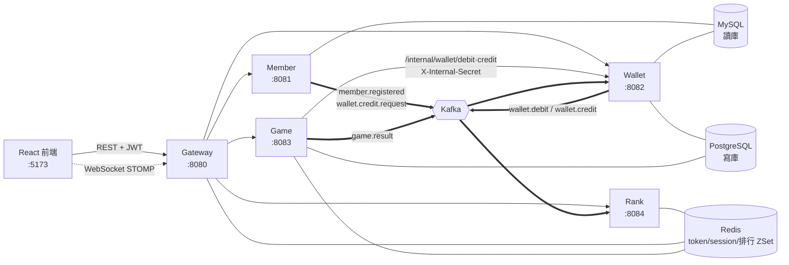
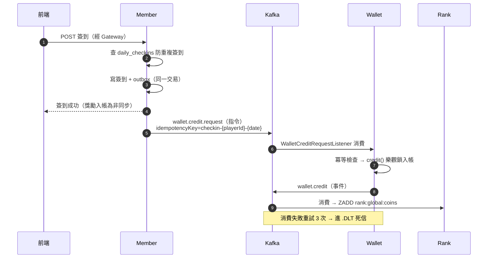
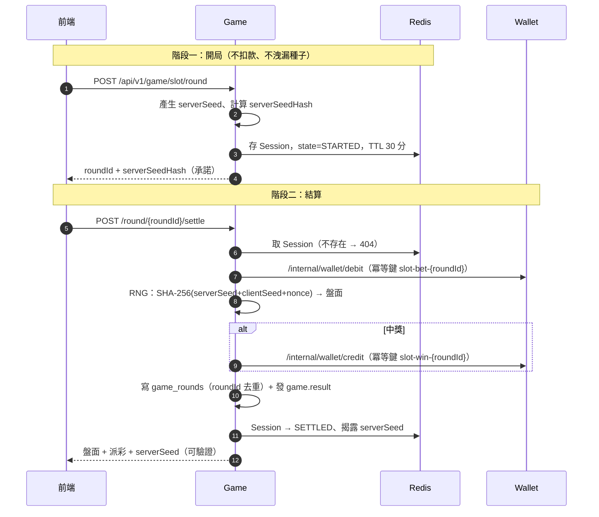
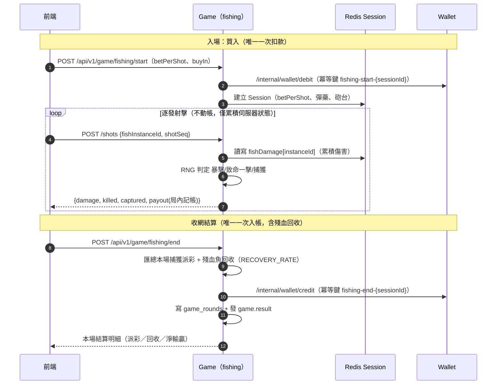

# 後端作品集 — 高併發練習。從賭場帳務系統到熔斷器根因定位
## 求職目標：後端工程師

## 目錄

- [一、Lucky Star Casino — 微服務賭場帳務系統](#一lucky-star-casino--微服務賭場帳務系統)
  - [1.1 系統架構](#11-系統架構)
  - [1.2 高併發實戰：從 78% 5xx 到根因定位與修復](#12-高併發實戰從-78-5xx-到根因定位與修復)
  - [1.3 帳務一致性設計](#13-帳務一致性設計)
  - [1.4 除錯能力](#14-除錯能力)
  - [1.5 捕魚機：機率模型設計與 RTP 經濟再平衡](#15-捕魚機-機率模型設計與-RTP-經濟再平衡)
- [二、Albee Stock — 美股自動交易機器人](#二albee-stock--美股自動交易機器人)
- [三、Sogno di Casa — Spring Boot 電商後端](#三sogno-di-casa--spring-boot-電商後端)
- [四、為何這些經驗適合高併發金融/博弈/量化職缺](#四為何這些經驗適合高併發金融博弈量化職缺)

---

## 一、Lucky Star Casino — 微服務賭場帳務系統

一個線上模擬幣賭場，帳務核心是大致使用**高併發金融級交易系統的簡化版**：同一秒內大量下注與派彩，不能多扣一塊也不能少派一塊；一旦服務降級或逾時，帳務仍必須保持零違規。這與運動彩票即時結算、交易所撮合入帳、量化交易下單回報，是同一類工程問題——差別只在貨幣的差別(遊戲幣或是美金)。以下聚焦在這套系統的高併發設計與一次真實的壓測除錯過程。

### 1.1 系統架構

Java 21 + Spring Boot 3.3.5 微服務，Spring Cloud Gateway 作為單一入口；CQRS 讀寫分離（PostgreSQL 寫庫 + MySQL 讀庫）；Kafka 作為事件匯流排；Redis 承擔 Token / Session / 排行榜。

**為何使用Java 21 + Spring Boot 3.3.5 微服務？**
- 因為Java 21生態成熟、Spring Boot對Kafka/Redis/JPA整合都有現成starter，再加上他也是LTS。

**Spring Cloud Gateway 單一入口？**
- 因為不想讓JWT驗證、限流、熔斷邏輯在5個服務裡各寫一份（維護太麻煩+容易漏改一處）。Gateway集中做這些橫切關注點，下游服務只信任Gateway注入的X-User-Id/X-User-Role，前端也只認一個host。壓測那次thundering herd問題就出在這層的熔斷設定，這算是集中化的代價：出事會卡住整個入口，但好處只要修一次就可以一次解決(不用再去各個點去修改)。

**CQRS分庫的原因？**
核心理由：帳務寫入跟高頻查詢是兩種完全不同的負載特性。
- 寫入（扣款/派彩）要強一致：樂觀鎖+UNIQUE冪等鍵，寧可鎖衝突重試也不能超扣，PostgreSQL在這塊的交易比較穩。
- 查詢（排行榜、交易紀錄）量大但不需要強一致，讀最新的前幾秒資料完全OK。如果讓查詢也打寫庫，鎖競爭會直接拖慢扣款——高併發下這是致命的。
分離後，MySQL讀庫透過Kafka事件非同步同步，最終一致即可，兩條負載互不干擾。

**Kafka事件匯流排**
服務間很多操作不需要「即時同步等回應」——簽到入帳、排行榜更新、新手禮發放，這些晚個幾百毫秒完全沒差。用Kafka解耦後：
1. member不用等wallet處理完才回應前端（簽到當下就能回200）。
2. 消費失敗有重試機制+死信隊列(DLT)兜底，不會整條鏈斷掉。
3. 指令/事件分離（wallet.credit.request指令 vs wallet.credit事件）避免服務互相消費對方發的東西造成無限迴圈。
高頻同步呼叫的地方（比如遊戲扣款）才走HTTP /internal/**，這是特意的取捨：非同步的用Kafka、需要立即結果的才同步呼叫。

**Redis：Token/Session/排行榜**
三種用途剛好都吃Redis的強項：
- JWT黑名單：需要TTL自動過期+極快查詢（每個請求都要查），Redis的O(1) key查詢會比打DB查表快得多，加上因為fail-closed設計（Redis掛了就當作token已撤銷，安全優先）
- 遊戲Session：老虎機開局到結算之間的暫存狀態，本來就是短生命週期資料，不需要落地到DB。
- 排行榜：ZSet資料結構天生就是為「排序+即時查名次」設計的，比在SQL裡做ORDER BY score快很多。

全系統以 Docker 容器化一鍵部署：7 個後端服務（gateway/member/wallet/game/rank/admin/notification）皆為 multi-stage build Dockerfile（`maven:3.9-eclipse-temurin-21` 建置 + `eclipse-temurin:21-jre-jammy` 執行期，non-root），`docker-compose.yml` 以 actuator healthcheck 串成依賴鏈，`docker compose up -d --build` 一行指令啟動全部 12 個容器（5 infra + 7 後端），取代原本多視窗手動 `mvn spring-boot:run` 的部署流程。

### 1.2 高併發實戰：從 78% 5xx 到根因定位與修復

這是這份作品集最重要的一段——一次完整的高併發壓測、故障重現、指標鏈根因定位、修復、驗證的閉環。

**問題**：對系統做 JMeter 壓力測試（T-090），150 併發與 1,000 併發下效能 gate（P99 < 500ms、5xx = 0）雙雙全 FAIL：

| 併發數 | HTTP 5xx | 失敗樣本 | P99 |
|---|---|---|---|
| 150 | 77.97% | — | 1,164 ms |
| 1,000 | 89.3% | — | 5,055 ms |

**診斷**：不是憑感覺猜測，而是用 Prometheus 90 秒測試窗的指標坐實根因鏈：

1. Gateway 的 Spring Cloud CircuitBreaker **未設定 `timelimiter`**，落到 Resilience4j 預設逾時 **1 秒**。
2. 但下游 CircuitBreaker 的 `slow-call-duration-threshold` 是 **3 秒**——也就是說，一個正常但稍慢的呼叫，會在真正完成前就被 TimeLimiter 攔腰砍斷判定為 failed，遠早於 CircuitBreaker 自己認定的「慢」門檻。
3. 高併發排隊下，大量正常請求被誤判失敗 → 觸發熔斷器開路 → half-open 少量放行 → 一旦關路，瞬間湧入的請求（thundering herd）再次推爆延遲 → 熔斷器反覆開闔，形成惡性循環。

這條指標鏈精確定位到：**問題不在慢，而在「量錯了慢」的逾時參數配置錯位**。

**修復**：5 個下游服務（member / wallet / game / rank / admin）各自設定 `resilience4j.timelimiter.instances.<service>.timeout-duration: 6s`，讓正常慢呼叫有機會真正跑完，交由 CircuitBreaker 自己的統計去判斷是否真的該熔斷，而不是被 TimeLimiter 提前誤殺。

**結果**（150 併發重測）：

| 指標 | 修復前 | 修復後 |
|---|---|---|
| HTTP 5xx | 13,563 次（78.0%） | **0 次** |
| 失敗樣本 | 13,563 | **4（0.05%）** |
| idempotency 違規 | 0 | 0 |
| overdraw 違規 | 0 | 0 |
| P99 | 1,164 ms | 2,667 ms（仍未達 500ms 門檻） |

修復後緊接著在 1,000 併發下做完整重跑驗證，避免「只在小規模驗證就宣告解決」：

| 指標 | 修復前 1,000 併發 | 修復後 1,000 併發 |
|---|---|---|
| HTTP 5xx | 13,709（86.1%） | **3,870（30.9%，−72%）** |
| CircuitBreaker `kind=failed` 呼叫數 | game≈1,172／wallet≈424 | **歸零** |
| overdraw / idempotency 違規 | 0 / 0 | **0 / 0** |

**誠實揭露**：1,000 併發下效能 gate 仍未達標（P99 5,291ms），但性質已經不同——熔斷器誤判環節已被 Prometheus 數據證實消除，殘餘的 503／client timeout 是 spin 熱路徑本身的計算負載問題（風控每局做約 500 局排序聚合 + 玩家當日聚合），而不再是配置錯位。這個根因已展開為分階段調校計畫並著手實作：全局 RTP 統計移出熱路徑改由排程每 2 秒寫入 Redis 快取（miss 才降級直查 DB）、玩家當日淨輸贏改用 Redis + Lua 原子計數器（`HINCRBY` + `PEXPIRE`，讀取端 miss 才回退 DB 聚合並回填）、`game_rounds` 補上複合索引止血、並發閘的 INCR+EXPIRE 兩次往返合併成單一 Lua script。過程中 code review 還額外抓出兩個併發邊界問題並修正：release 併發閘時裸 `DECR` 若 key 恰好過期會重建出無 TTL 的負值計數器（並發閘永久失效），以及日水位 hash 若只寫入一半欄位就中斷，會讓淨輸贏誤算為負——两處都改成更嚴謹的 Lua 原子操作與「殘缺視同 miss」語意。

**全程帳務零違規**：從第一輪 150 併發測試到後續每一輪重測，`idempotency=0`、`overdraw=0` 從未被打破——即便在效能 gate 全面 FAIL、系統大量降級的情況下，帳務正確性這條紅線也沒有鬆動。這正是冪等鍵 + 樂觀鎖設計在真實壓力下的驗證。

**後續兩輪迭代（C1/C2 → C3/B1）：從「消除誤判」到「主動限流」**。TimeLimiter 修正只解決了熔斷器誤判，1,000 併發下真正的瓶頸——單機 Postgres 交易容量、spin 熱路徑計算負載——仍在。後續兩輪針對性補強：

- **C1+C2**（gateway 併發上限固定 200、JWT Redis 撤銷檢查短重試）：1,000 併發下成功數 +126%（653→1,477）、401 錯誤 −63%、5xx −37%、成功 spin 平均延遲腰斬（5.21s→2.65s）。但殘餘瓶頸換位置——湧向沒設上限保護的 `/api/v1/wallet/**` 路徑（401/SocketTimeout 過半集中在此）。
- **C3+B1**（`AdaptiveInFlightLimiter`：AIMD 演算法，per-route 各自獨立、延遲窗 P95 超標×0.8／達標+2、floor 50／ceiling 400／初始 200／延遲目標 2s／每 5 秒調整一次，並把 wallet 路徑首次納入保護；疊加 HikariCP pool 10→15 修正）：150 併發 P99 2,753→1,423ms（−48%）、吞吐近翻倍（86.8→169.7/s），0 失敗 0 誤傷持穩；1,000 併發下成功 +430%（1,477→7,829）、401 歸零、SocketTimeout −94%、wallet debit 平均延遲 581→492ms。429 卸載佔比雖升到 65.3%（因執行緒循環變快、需求端量體上升），但**被接受請求的成功率從 23.9% 拉到 78.4%**——這才是機制生效的正確讀數，而非表面的卸載率數字。

**目前系統容量結論**：單機 PostgreSQL 交易容量實測天花板 ≈ 550–600 筆/秒，這是 1,000 併發在單機拓樸上永遠得靠 429 卸載消化的根本原因（多機或降低驗收併發需求屬於下一階段容量規劃課題）。應用層在「P99 逼近門檻」的可持續吞吐約 150–170 req/s（150 併發輪的實測值）；Gateway 的 AIMD 限流器把每條路由的同時在途請求動態夾在 50–400 之間，超過上限一律回 429 快速失敗，而不是讓請求排隊到後端資源被打爆——這正是「效能 gate 沒過，但帳務 gate 全程 PASS、系統安全降級不弄壞帳」的機制來源。

### 1.3 帳務一致性設計

帳務零違規不是巧合，而是設計出來的：

- **冪等鍵**：每一筆扣款/入帳都帶唯一 `idempotency_key`（資料庫 UNIQUE 約束），同一操作的並發重試或客戶端重送，都只會成功入帳一次。
- **樂觀鎖**：錢包餘額欄位帶 `@Version`，並發扣款寧可讓其中一個請求因版本衝突重試，也不允許超扣。
- **CQRS 讀寫分離**：PostgreSQL 承擔帳務寫入（強一致），MySQL 承擔高頻查詢讀取（排行榜、交易紀錄等），由 Kafka 事件保持最終一致。
- **Kafka 指令/事件分離**：例如 `wallet.credit.request` 是「請入帳」的**指令**（由 member 發出、wallet 消費），`wallet.credit` 是「已入帳」的**事件**（由 wallet 發出、rank 消費）——wallet 絕不消費自己發出事件的同名指令，避免無限迴圈。

以每日簽到入帳為例，指令與事件清楚分離、失敗有死信隊列兜底：

老虎機採用兩階段 commit-ahead：開局先承諾隨機種子雜湊（不扣款、不洩漏種子），結算才真正扣款與派彩，確保 Provably Fair 公平性與帳務原子性不互相干擾：

### 1.4 除錯能力

除了壓測，全代碼掃描式的除錯也修過幾個值得一提的併發與資料正確性問題：

- **並發結算 race condition**：老虎機/百家樂結算寫入時，`findByRoundId()` 去重檢查與 `save()` 之間沒有防護，並發重試會讓兩個請求都通過去重檢查，第二筆再觸發資料庫 UNIQUE 約束，玩家直接收到 500 錯誤（wallet-service 早已用同一模式正確處理，此處是遺漏）。修法是補上 `catch DataIntegrityViolationException`，視為已被另一請求結算並正常回應——帳務本身冪等，這種情況不該讓使用者看到錯誤。
- **登出黑名單前綴不一致**：member 服務登出時把 JWT 的 `jti` 寫入 `blacklist:{jti}`，但 Gateway 驗證時查的是 `jwt:blacklist:{jti}`。兩邊前綴對不上，導致登出後 access token 在自然到期前，於 Gateway 端實際上**仍可通行**——撤銷機制形同未生效。這類跨服務約定不一致的 bug 不會在單一服務的單元測試中曝光，只有整合驗證才抓得到。
- **監控指標誤報**：後台 RTP（Return to Player）監控把「本時段尚無下注樣本」的遊戲，用 `actual=0` 硬跟設計值比較，deviation 必然打到門檻外，永遠誤報 ABNORMAL。修法是新增 `NO_DATA` 三態，`totalBet<=0` 時直接跳過偏差判定，避免監控面板對著沒有資料的東西發假警報——這類問題在正式環境的告警系統中很常見，誤報過多會讓工程師開始忽略真正的警報。
- **防禦性守衛先於問題發生就修**：錢包扣款的守衛條件原本只檢查 `balance < amount`，沒有扣除 `frozenAmount`（凍結金額）。當下專案裡凍結機制尚未真正啟用（`frozenAmount` 恆為 0），所以這不是一個「現正發生」的 bug，而是掃描全代碼時發現的一個**未來一旦啟用凍結功能就會超扣**的地雷。修法是把守衛條件改成用可用餘額（`balance − frozenAmount`）判斷，在功能還沒上線前就先把邏輯補正確——比起等出事後修，這種防禦性修復的成本低得多。
- **誤報排除的紀律**：全代碼掃描抓 bug 時，也用同樣的嚴謹度處理「疑似 bug」——例如懷疑過的「OutboxPoller 沒有排程啟動」、「RNG clientSeed 空字串未處理」、「Gateway 黑名單 Redis 故障時放行」，逐一回頭讀原始碼驗證後，四個都確認是誤報（分別是 `@Scheduled` 確實存在、`StringUtils.hasText()` 已處理、以及設計本就是 fail-closed）。把這些誤報如實記錄下來，而不是抓到疑點就直接動手改，避免了「修一個不存在的問題、卻可能引入新問題」的風險，也讓後續協作者不用重查一次同樣的疑點。

### 1.5 捕魚機：機率模型設計與 RTP 經濟再平衡

捕魚機比老虎機/百家樂多一個維度的複雜度——魚有血量、傷害逐發累積、命中與擊殺是兩件事，這讓「怎麼保證 RTP（Return to Player）不被破壞」變成一個要用數學而不是直覺去驗證的問題。這條設計演進本身就是一次典型的「模型上線後發現體感與理論脫節、回頭用機率分析定位原因並修正」的過程，跟量化交易裡「策略回測達標、實盤表現卻不如預期，要回去檢查模型假設」是同一種思維訓練。

**遊戲架構與 wallet-service 的互動**：捕魚機每一場只跟 wallet-service 動兩次帳，這是刻意設計——中間不論打了幾百發子彈、命中幾條魚，逐發判定全部在 game-service 內存 session 計算，帳務只在「入場」與「收網結算」各觸發一次冪等呼叫，避免每發子彈都打一次錢包造成不必要的高頻寫入與冪等鍵管理負擔：

這樣設計也讓帳務零變動：不管 RTP 數學怎麼從 92% 調到 96%、砲台傷害怎麼收斂、殘血回收公式怎麼改，wallet-service 看到的永遠只是「開局扣一次、結算入一次」，冪等鍵與樂觀鎖機制完全不受遊戲玩法演進影響——玩法與帳務兩層關注點徹底分離。

**首版模型（ADR-003）**：每條魚有 HP，每砲每發有基礎傷害，命中累積傷害；傷害歸零那一發是致命一擊，觸發捕獲判定 `pCapture`，捕獲才派彩，掙脫則子彈全數沉沒。關鍵設計選擇是讓 `HP(魚種) = 倍率 × 平均傷害`，使得任何魚種、任何砲台的期望 RTP 都精確相等——玩家專打高倍魚沒有套利空間，砲台只改變手感節奏（打得快/打得慢），不改變期望值。傷害累積、致命一擊判定、派彩全部在伺服器算，client 只能決定「打哪條、何時打」，決定不了輸贏；每發都用 `serverSeed + clientSeed + shotSeq` 的 Provably Fair 串流，可重放驗證。

**上線後的落差（ADR-004）**：數學上 RTP 設計值是 92%，但這個值只在「玩家把每條鎖定的魚都打死」時成立。實測發現大魚（例如龍王銅炮要打 ~167 發）只要在打死前游出畫面，投入的子彈就全數沉沒——若約半數子彈打在最終逃走的魚上，體感 RTP 會掉到 `0.5 × 0.92 ≈ 46%`，跟玩家「感覺虧了一半」的回饋完全吻合。這是一個「設計值算對了，但沒算到真實分佈」的模型缺口。

**修正**：對「受傷但未打死」的魚，結算時依已造成的傷害換算出期望耗彈成本，按 `RECOVERY_RATE`（0.70）比例部分退還子彈成本。這讓每一發子彈的期望回報被夾在 `[RECOVERY_RATE, TARGET_RTP]` 之間：打死路徑的子彈期望回報等於設計 RTP（0.96，同步從 92% 上調），游走殘血魚的子彈至少拿回 70% 成本——回收金額恆小於等於投入成本，數學上保證**不會讓整體 RTP 超過設計值**（莊家安全），但把玩家最差的體感虧損從 ~50% 壓到 30% 以內。同時把三檔砲台的傷害差距從 10/17/26 收斂到 10/14/18，避免金炮把中小魚一發打死導致致命一擊後捕獲率過低（燈籠魚原本只有 0.33）的挫折感。這裡也記錄了一個「非顯而易見的設計取捨」：為什麼不直接把捕獲率設個地板值——因為 `RTP = 捕獲率 × 倍率 / 期望耗彈數` 是聯立方程，硬把某個變數拉高會讓另一頭的 RTP 超付，唯一在不破壞整體 RTP 前提下改善體感的手段，是縮小砲台傷害差距這個自由度。

這條演進線示範的能力，是量化/博弈類職缺特別看重的：**先建立可驗證的機率模型（Provably Fair + RTP 公式），上線後用真實數據/ 使用者回饋檢驗模型假設是否成立，發現落差時用邊界分析（地板/天花板）而不是拍腦袋調參來修正，且全程守住「莊家不超付」這條不可退讓的紅線**。

**工程紀律：ADR 驅動架構決策**。這套系統對任何影響全局行為或有取捨的設計決策，都要求先寫 ADR（Architecture Decision Record）再動工——CQRS 讀寫分離（ADR-001）、Kafka 指令/事件分離避免消費迴圈（ADR-002）、捕魚機 HP/傷害模型（ADR-003）、RTP 經濟再平衡（ADR-004）、Saga 補償機制（ADR-009）等，每份 ADR 都包含背景、決策、數學或架構推導、後果與注意事項、驗證方式。這種「先把取捨寫清楚、留下可追溯的決策紀錄」的習慣，在多人協作與長期維運的高併發系統裡，是避免「三個月後沒人知道當初為什麼這樣設計」的關鍵實踐。同一份紀律也體現在架構改進本身的追蹤上：把總體檢報告提出的八項改進建議落成 `docs/plans/` 施工藍圖，逐項標記完成/進行中/未開工與相依關係（例如「壓測要先有觀測性才能做」「Saga 補償與契約統一應串行、都動同一個服務」），讓多人協作時看得到全局進度，而不是各自零散地修。

---

## 二、Albee Stock — 美股自動交易機器人

個人獨立開發的美股自動交易機器人，FastAPI + React + Alpaca API，多 Bot 架構、每個 Bot 獨立跑一種策略，從 Paper Trading 開始逐階段迭代出回測引擎、風控出場、多 Bot 管理與自動化決策層。

**架構決策一：「回測 = 實盤」誠信框架**。多數個人量化專案的通病是回測 EV 好看、實盤卻不如預期，根源常是回測偷看了未來或用了跟實盤不同的資料路徑。這裡把「回測看到的期望值必須是實盤拿得到的期望值的誠實估計」定成不可違反的架構鐵則：實盤與回測強制走同一資料源與同一回看長度、回測計入手續費與滑價並用「訊號隔日開盤成交」（不用當根收盤價，避免偷看未來報虛高 EV）、策略排名與部署門檻一律看樣本外（OOS）表現而非樣本內最佳（防過擬合）。

**架構決策二：誠實的分層驗證機制**。系統疊了狀態辨識、凱利部位、meta-labeling 等多層加分機制，但每加一層都強制做 baseline-vs-candidate 的樣本外比較，用數據判定這層是否真的值得留下——不是加了就留。實測結果誠實記錄：meta-labeling 驗證通過保留，凱利部位與狀態自適應層樣本外未加分，總體經濟資料層（Phase 11）驗證後確認無貢獻直接砍除。這種「敢把自己加的功能砍掉」的驗證紀律，比起無腦疊加特徵更接近正式量化團隊的工程文化。

技術亮點：資料庫用 Neon（Serverless Postgres），長時間連線閒置容易被雲端端悄悄斷開，若無存活探測，要等下一次交易信號觸發才會發現連線已死。修法是在連線池設定 TCP keepalive，讓斷線在真正需要用連線之前就被偵測並重建——與 Lucky Star Casino 的 Redis fail-closed、Kafka 死信隊列同一種思路：預先假設基礎設施會斷線。

**為何後續轉向加密貨幣（Albee Crypto）**：美股個股的價格波動有相當比例是消息面/基本面驅動（財報、新聞、總經事件），這類訊號難以單純用價量技術面建模，也曾在總經資料層（Phase 11）驗證後證實加不了分；而加密貨幣 24/7 交易、消息面影響相對單純、更純粹反映價量與技術結構的短線/波段行為，適合純技術面策略發揮。因此後續專案改聚焦「非消息面」的加密貨幣＋大盤 ETF 短線交易系統，延續同一套回測誠信框架與驗證紀律。

技術棧：Python（FastAPI）、React、PostgreSQL（Neon）、Alpaca Trading API、WebSocket 即時報價、APScheduler。

---

## 三、Sogno di Casa — Spring Boot 電商後端

Spring Boot 電商後端專案，練習標準的 REST API 分層架構與 Spring Security 認證授權；曾修復一項安全性缺陷（權限/驗證相關漏洞的收斂），強化了對「授權檢查不能只做在前端」這件事的敏感度——這也是 Lucky Star Casino 裡 admin-service 稽核紀錄、角色權限收斂等修復背後同樣的原則。

---

## 四、為何這些經驗適合高併發金融/博弈/量化職缺

- **帳務正確性 ↔ 交易正確性**：冪等鍵 + 樂觀鎖 + CQRS 讀寫分離，是為了在高併發下讓「錢」永遠對得上——這與交易所撮合引擎、彩票即時結算、量化系統下單回報要求的正確性完全同構。壓測全程 `idempotency=0`、`overdraw=0` 從未被打破，證明這套設計在真實壓力下站得住。
- **熔斷器根因定位與調校 ↔ 高頻交易系統穩定性**：不是憑感覺調參數，而是用 Prometheus 指標鏈坐實「TimeLimiter 誤判 × thundering herd」的根因，修復後用 150 併發與 1,000 併發兩輪數據驗證效果（78%→0%、86.1%→30.9%），並誠實記錄尚未解決的部分與下一步方向。這種「量測 → 定位 → 修復 → 再量測」的閉環，正是維運高頻交易或即時撮合系統時每天都要做的事。
- **容器化一鍵部署 ↔ 交易所的可靠上線能力**：7 個微服務全部容器化、healthcheck 依賴鏈確保啟動順序正確，`docker compose up -d --build` 一行指令重現整套環境，並在驗證過程中抓出並修復「全新環境缺表導致啟動卡死」這類只有在乾淨環境才會曝光的部署缺陷——這是金融/博弈系統在多環境（測試/預發布/正式）間可靠上線所必需的能力。
