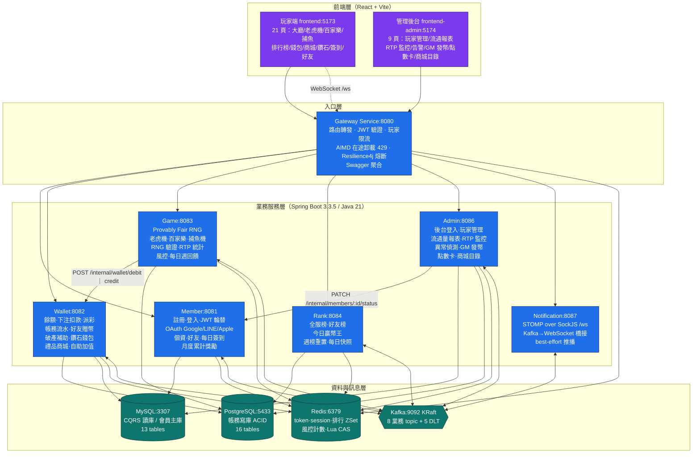
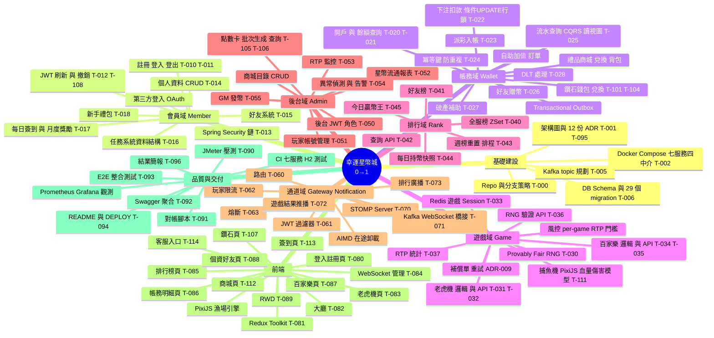
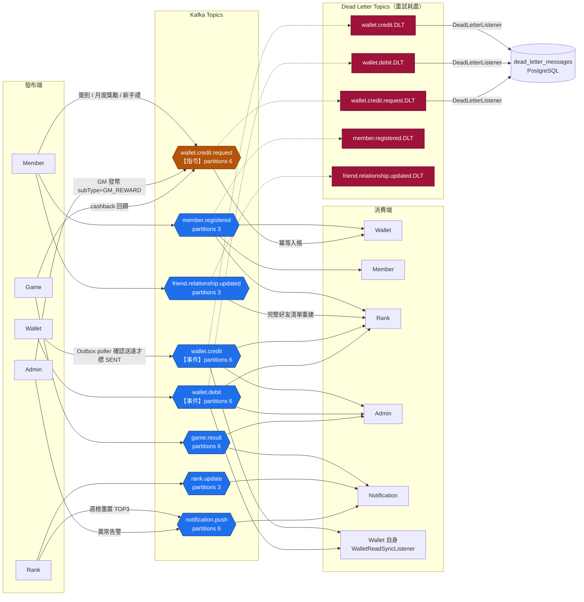
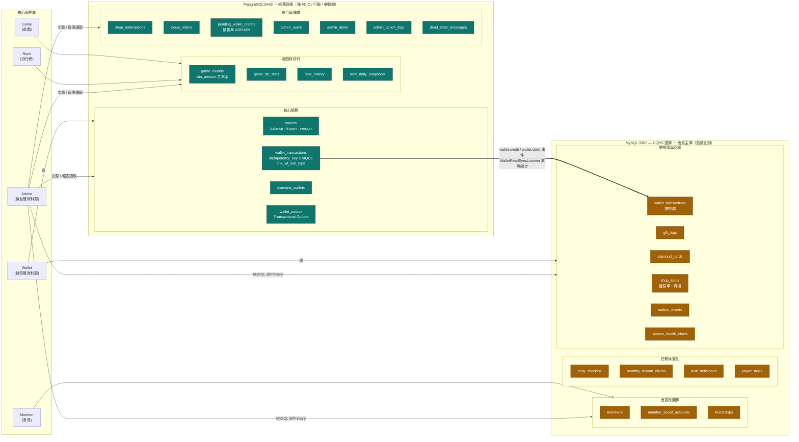
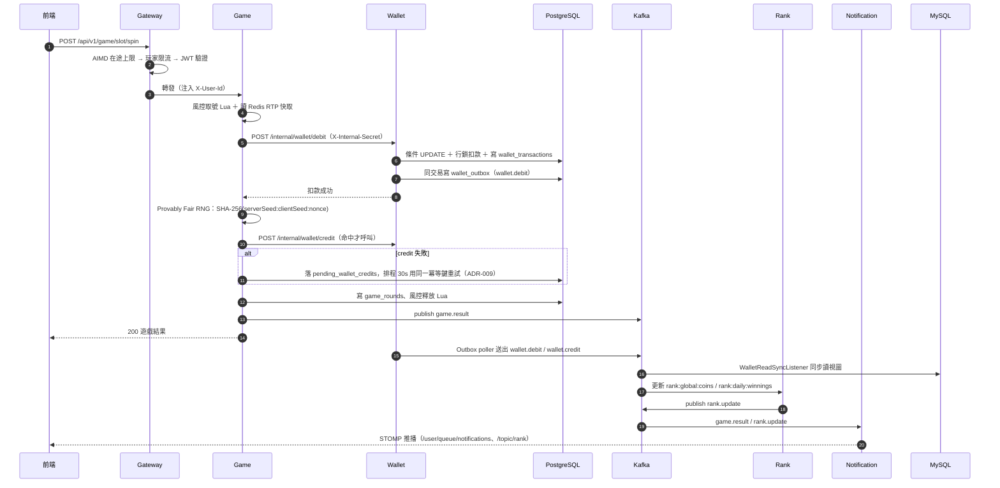
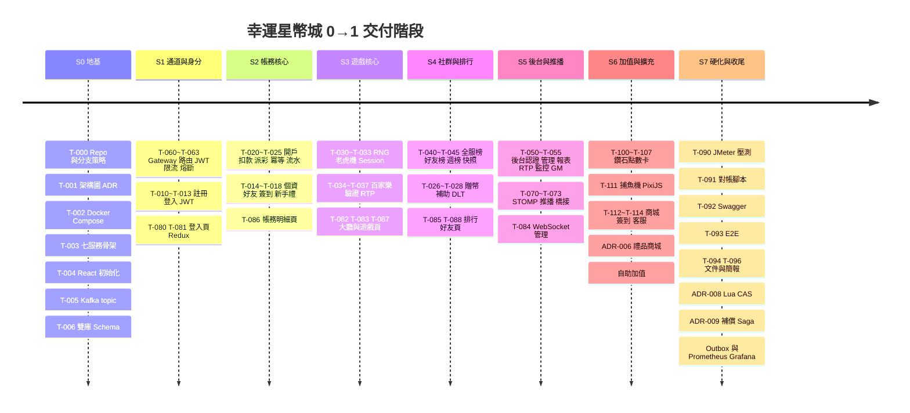

# 幸運星幣城 — 功能架構圖 / Kafka 事件圖 / 雙資料庫歸屬圖

> **用途**：撰寫分工表（0→1 全貌）時的視覺附件。
> **資料來源（2026-07-26 依程式碼盤點）**：`kafka/kafka-init.sh`、`database/postgres/init.sql`、
> `database/mysql/init.sql`、`docs/architecture.md`、`tools/audit/tasks.json`、
> `docs/幸運星幣城_工作分配表.xlsx`。
> 與程式碼衝突時以程式碼為準（AGENTS.md §5）。
>
> 圖皆為 Mermaid，GitHub / VS Code / <https://mermaid.live> 可直接渲染（`timeline` 需 Mermaid v10+）。

---

## 1. 系統功能架構圖（分層）

> **邊界鐵則**：前端只打 Gateway；服務間同步呼叫走 `/internal/**` + `X-Internal-Secret`；
> 其餘一律 Kafka 非同步。Admin token 用另一組 `ADMIN_JWT_SECRET`，故 `/admin/**` 在
> gateway 白名單內純轉發（雷區 21）。

---

## 2. 功能模組拆解（分工顆粒度用）

---

## 3. 功能架構表（服務 × 功能 × 資料 × 事件 × 任務編號）

| 服務 | 核心功能 | 對外前綴 / 端點數 | Kafka 發布 | Kafka 消費 | PostgreSQL | MySQL | Redis | 任務編號 | 分配表負責人 |
|---|---|---|---|---|---|---|---|---|---|
| **Gateway** 8080 | 路由、JWT 驗證、限流、AIMD 卸載、熔斷、Swagger 聚合 | 0 個 REST（全域 Filter） | — | — | — | — | `rate:player:*`、讀黑名單／`min-iat` | T-060~T-063 | 張鈞皓（組長A） |
| **Member** 8081 | 註冊／登入／JWT 輪替、OAuth、個資、好友、簽到、月度獎勵 | `/api/v1/auth`、`/player`、`/friends`、`/wallet/daily-checkin`；**22** | `member.registered`、`friend.relationship.updated`、`wallet.credit.request` | `member.registered` | — | `members`、`member_social_accounts`、`friendships`、`daily_checkins`、`monthly_reward_claims`、`task_definitions`、`player_tasks`、`outbox_events` | `refresh:*`、`jwt:blacklist:*`、`disabled:player:*`、OAuth ticket | T-010~T-018、T-108、T-109 | 張鈞皓（組長A） |
| **Wallet** 8082 | 餘額、扣款、派彩、流水、贈幣、補助、鑽石、商城、加值 | `/api/v1/wallet/**`＋`/internal/wallet/**`；**18** | `wallet.debit`、`wallet.credit`（**經 Outbox**） | `member.registered`、`wallet.credit.request`、`wallet.credit`／`wallet.debit`（僅讀視圖同步）、3 支 `*.DLT` | `wallets`、`wallet_transactions`、`diamond_wallets`、`shop_redemptions`、`topup_orders`、`wallet_outbox`、`dead_letter_messages` | `wallet_transactions`（讀視圖）、`gift_logs`、`diamond_cards`（讀）、`shop_items`（讀） | 贈幣／補助當日計數 | T-020~T-028、T-101~T-104 | 林暐彧（組員C） |
| **Game** 8083 | RNG、老虎機、百家樂、捕魚機、驗證、RTP、風控、回饋 | `/api/v1/game/**`；**14** | `game.result`、`wallet.credit.request`（cashback） | — | `game_rounds`、`game_rtp_stats`、`cashback_records`、`pending_wallet_credits` | — | 遊戲／捕魚 session、`risk:*`（RTP 快取、並發閘、當日水位） | T-030~T-037、T-111 | 黃崇瑜（組員B） |
| **Rank** 8084 | 全服榜、好友榜、贏幣王、週榜重置、每日快照 | `/api/v1/rank/**`；**6** | `rank.update`、`notification.push` | `member.registered`、`wallet.credit`、`wallet.debit`、`friend.relationship.updated` | `rank_history`、`rank_daily_snapshots` | — | `rank:global:coins`、`rank:friend:*`、`rank:daily:winnings`、`rank:player:usernames` | T-040~T-045 | 許銘仁（組員D） |
| **Admin** 8086 | 後台登入、玩家管理、流通報表、RTP 監控、異常偵測、GM 發幣、點數卡、商城目錄 | `/admin/**`；**14** | `notification.push`、`wallet.credit.request`（GM 發幣） | `game.result`、`wallet.credit`、`wallet.debit` | `admin_users`、`admin_alerts`、`admin_action_logs`（＋讀 `wallet_transactions`／`game_rounds` 做報表） | **`@Primary`**：`members`、`diamond_cards`、`shop_items` | 停用玩家封鎖旗標 | T-050~T-055、T-105、T-106 | 許銘仁（組員D） |
| **Notification** 8087 | STOMP `/ws`、Kafka→WebSocket 推播 | 0 個 REST（3 支 consumer） | — | `notification.push`、`game.result`、`rank.update` | — | — | — | T-070~T-073 | 許銘仁（組員D） |
| **前端** 5173／5174 | 玩家端 21 頁＋後台 9 頁＋PixiJS 漁場引擎 | — | — | — | — | — | — | T-080~T-089、T-107、T-112~T-114 | 王竣揚（組員E） |
| **DevOps／品質** | Docker Compose、CI、migration、壓測、對帳、觀測 | — | — | — | — | — | — | T-000~T-006、T-090~T-096、T-110 | 許銘仁＋張鈞皓 |

> **負責人欄位口徑**：取自 `docs/幸運星幣城_工作分配表.xlsx`（2026-06-16 起代號已改真名）。
> 這一欄是**分配表上的計畫負責人**，不是「誰寫了幾行」的統計；貢獻度另有口徑，不在本檔範圍。
>
> **分工表度量提醒**：REST 端點數（合計 74）會讓 gateway／notification／前端／DB／測試歸零。
> 建議一併計入的工作量：13 支 `@KafkaListener`、14 支 `@Scheduled`、
> 29 個 migration（PG 17／MySQL 12）、128 個後端測試檔、5 支 Playwright e2e、8 支 `tests/infra`、
> 2 支 JMeter、12 份 ADR、5 份施工藍圖。

---

## 4. Kafka 事件圖（8 業務 topic + 5 DLT）

**讀圖三個關鍵約定：**

1. **指令 vs 事件（ADR-002）**：`wallet.credit.request` 是「請幫我入帳」的**指令**，只有 wallet 消費；
   `wallet.credit`／`wallet.debit` 是「已入帳／已扣款」的**事件**。發指令的服務（member／admin／game）
   一律不自己寫 wallet。
2. **不可迴圈（雷區 6）**：消費 `wallet.credit`／`wallet.debit` 的 listener 絕不可回頭呼叫
   `credit()`／`debit()`。唯一安全例外是 `WalletReadSyncListener` — 它只寫 MySQL 讀視圖並做
   `existsById` 冪等檢查。
3. **消費端去重看操作是否冪等（藍圖 04 P1）**：`ZADD` 絕對值＝冪等，**不可**加去重；
   `ZINCRBY` 累加＝非冪等，需用 `transactionId` 做 Redis `SETNX`。Notification 為 best-effort，
   刻意**不設 DLT**；`member.registered.DLT`／`friend.relationship.updated.DLT` 目前只建 topic、
   尚無 listener 落地。

---

## 5. 雙資料庫歸屬圖（PostgreSQL 寫 / MySQL 讀，ADR-001）

> **為什麼這樣切**：帳務不能出錯 → 走 PG（樂觀鎖 `wallets.version`＋冪等鍵 UNIQUE＋行鎖條件 UPDATE）；
> 查詢量大且可容忍毫秒級延遲 → 走 MySQL 讀視圖，用 Kafka 事件同步。
> **wallet 是雙資料源（雷區 5）**：`spring.jpa.*` 無效，兩個 `EntityManagerFactory` 在
> `DataSourceConfig` 手動建立；跨庫讀取必須拆到用 `mysqlTransactionManager` 的獨立 Bean。

---

## 6. 一筆下注貫穿全系統（把三張圖串起來）

---

## 7. 0→1 建置階段（分工表時間軸）

---

## 8. 引用來源

| 主題 | 檔案 |
|---|---|
| Topic 清單／partition 數／DLT | `kafka/kafka-init.sh`（增刪要同步 `tests/infra/kafka.test.js`，雷區 7） |
| PG／MySQL 表 | `database/postgres/init.sql`、`database/mysql/init.sql` |
| 服務邊界、Redis key、請求流程 | `docs/architecture.md` |
| 任務編號與擁有者 | `tools/audit/tasks.json`、`docs/幸運星幣城_工作分配表.xlsx` |
| 端點／listener／排程／測試檔數量 | `git grep -c "@*Mapping"`、`@KafkaListener`、`@Scheduled` 逐服務盤點 |
| 架構決策 | `docs/adr/ADR-000` ~ `ADR-011` |
